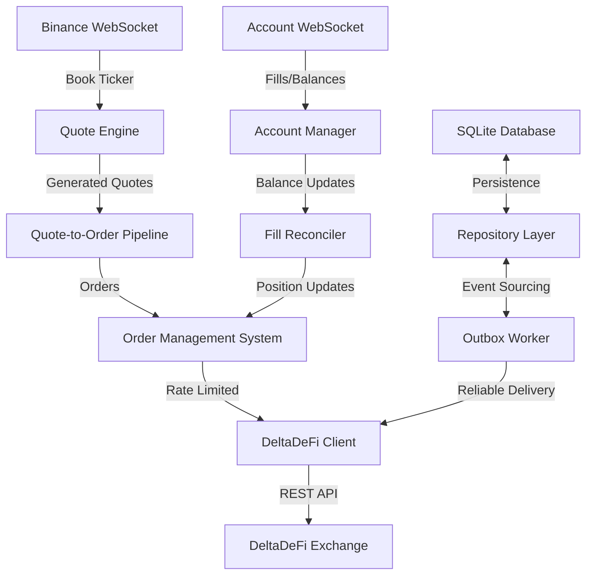

# DeltaDeFi Trading Bot

A sophisticated Python trading bot for automated market making between Binance and DeltaDeFi exchanges using real-time WebSocket feeds, advanced order management, and comprehensive risk controls.

## Features

- **Real-time Market Making**: Mirrors Binance ADAUSDT to DeltaDeFi ADAUSDM with configurable spreads
- **Advanced Order Management**: Full order lifecycle with state machine and risk controls
- **Production-Ready**: Rate limiting, database persistence, fault tolerance, and structured logging
- **Developer-Friendly**: Modern Python 3.11+, full type safety, comprehensive testing, and quality tooling

## Quick Start

### Prerequisites

- Python 3.11+ and [uv](https://github.com/astral-sh/uv) package manager
- DeltaDeFi API key and trading password

### Installation & Setup

```bash
# Clone and install
git clone <repository-url> && cd trading-bot
make install && make hooks

# Configure credentials
cp .env.example .env
# Edit .env with your DeltaDeFi API key and trading password

# Start trading
make run
```

> **📖 For detailed setup, configuration, and usage instructions, see:**
>
> - **[User Guide](docs/02-user-guide.md)** - Complete setup and configuration
> - **[Configuration Guide](CONFIG.md)** - Configuration system and options
> - **[Development Guide](DEVELOPMENT.md)** - Development setup and code quality

## Architecture

The bot uses a modular architecture with clear separation between market data ingestion, quote generation, order management, and exchange connectivity:



> **🏗️ For detailed architecture documentation, see [Architecture Overview](docs/architecture/overview.md)**

## Development

### Project Structure

```sh
trading-bot/
├── bot/                    # Main application code
├── docs/                   # Documentation
│   ├── architecture/       # System architecture details
│   ├── 02-user-guide.md   # User setup and configuration
│   └── 03-deployment.md   # Production deployment guide
├── tests/                  # Test suite
├── CONFIG.md              # Configuration system guide
├── DEVELOPMENT.md         # Development setup and standards
└── README.md              # This file
```

### Development Commands

```bash
make help          # Show all commands
make test          # Run test suite
make fmt           # Format code with ruff
make lint          # Lint code with ruff
make precommit     # Run all quality checks
```

> **👩‍💻 For detailed development setup, code standards, and testing, see [Development Guide](DEVELOPMENT.md)**

## Documentation

| Document                                                   | Purpose                                 |
| ---------------------------------------------------------- | --------------------------------------- |
| **[User Guide](docs/02-user-guide.md)**                    | Installation, configuration, monitoring |
| **[Deployment Guide](docs/03-deployment.md)**              | Production deployment and operations    |
| **[Configuration Guide](CONFIG.md)**                       | Configuration system and all options    |
| **[Development Guide](DEVELOPMENT.md)**                    | Code standards and development setup    |
| **[Architecture Overview](docs/architecture/overview.md)** | System design and components            |

### Component Documentation

- **[Order Management System](docs/architecture/oms.md)** - Order lifecycle and risk management
- **[Quote Engine](docs/architecture/quote-engine.md)** - Price generation and BPS calculations
- **[Account Manager](docs/architecture/account-manager.md)** - Balance tracking and reconciliation
- **[Rate Limiter](docs/architecture/rate-limiter.md)** - API rate limiting implementation
- **[Database Layer](docs/architecture/database.md)** - Data persistence and migrations
- **[DeltaDeFi Integration](docs/architecture/deltadefi-integration.md)** - Exchange connectivity
- **[Binance Integration](docs/architecture/binance-integration.md)** - Market data ingestion

## Support

- **Documentation**: See links above for comprehensive guides
- **Issues**: Report bugs via GitHub issues
- **Development**: See [DEVELOPMENT.md](DEVELOPMENT.md) for contribution guidelines
