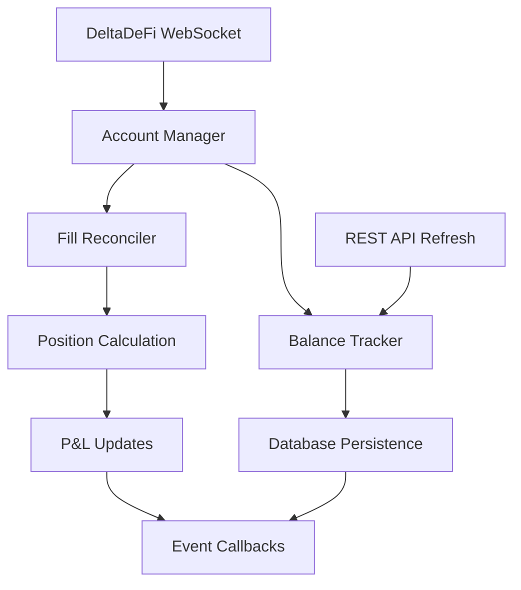

# Account Manager

The Account Manager provides comprehensive account state management including real-time balance tracking, fill reconciliation, and position management through DeltaDeFi WebSocket feeds.

**Location**: `bot/account_manager.py:572`

## Overview

The Account Manager serves as the system's source of truth for account state, processing real-time updates from DeltaDeFi WebSocket feeds and maintaining accurate balance and position data with historical tracking.

### Key Features

- **Real-time Balance Tracking**: Live balance updates with historical snapshots
- **Fill Reconciliation**: Automatic position updates from trade executions
- **WebSocket Management**: Robust connection handling with automatic reconnection
- **Event-Driven Architecture**: Callback-based notifications for account events
- **Database Persistence**: Reliable storage of account state and history

## Architecture



## Core Components

### 1. Account Manager (Main Coordinator)

**Location**: `bot/account_manager.py:572`

```python
class AccountManager:
    def __init__(self, deltadefi_client: DeltaDeFiClient):
        self.deltadefi_client = deltadefi_client
        self.balance_tracker = BalanceTracker()
        self.fill_reconciler = FillReconciler(self.balance_tracker)
        self.account_ws: AccountWebSocket | None = None
        self.running = False
        self.connection_retry_count = 0
        self.max_retries = 5
```

**Key Responsibilities**:

- Coordinate WebSocket connection management
- Route account updates to appropriate processors
- Provide unified interface for account state queries
- Handle connection failures with exponential backoff

### 2. Balance Tracker

**Location**: `bot/account_manager.py:118`

```python
class BalanceTracker:
    def __init__(self):
        self.current_balances: dict[str, AccountBalance] = {}
        self.balance_callbacks: list[Callable] = []
        self._balance_lock = asyncio.Lock()
```

**Features**:

- **Multi-Asset Support**: Track balances for multiple assets simultaneously
- **Lock-Free Updates**: Async-safe balance modifications
- **Historical Persistence**: Store balance snapshots in database
- **Change Detection**: Only log significant balance changes
- **Callback System**: Real-time notifications for balance updates

### 3. Fill Reconciler

**Location**: `bot/account_manager.py:242`

```python
class FillReconciler:
    def __init__(self, balance_tracker: BalanceTracker):
        self.balance_tracker = balance_tracker
        self.processed_fills: set[str] = set()
        self.fill_callbacks: list[Callable] = []
        self.position_callbacks: list[Callable] = []
```

**Features**:

- **Duplicate Prevention**: Track processed fills to avoid double-counting
- **Position Calculations**: Real-time average price and P&L updates
- **Balance Reconciliation**: Update asset balances based on fills
- **Event Publishing**: Outbox pattern for reliable event delivery

## Data Structures

### Account Balance

**Location**: `bot/account_manager.py:86`

```python
@dataclass
class AccountBalance:
    asset: str                    # Asset symbol (e.g., "ADA", "USDM")
    available: Decimal           # Available for trading
    locked: Decimal             # Locked in orders
    total: Decimal              # available + locked
    updated_at: float = field(default_factory=time.time)

    @classmethod
    def from_websocket_data(cls, asset: str, data: dict) -> "AccountBalance":
        """Create from DeltaDeFi WebSocket data"""
        available = Decimal(str(data.get("available", 0)))
        locked = Decimal(str(data.get("locked", 0)))
        return cls(asset=asset, available=available, locked=locked,
                  total=available + locked)
```

### Account Fill

**Location**: `bot/account_manager.py:48`

```python
@dataclass
class AccountFill:
    fill_id: str
    order_id: str
    symbol: str                  # Trading pair (e.g., "ADAUSDM")
    side: str                   # "buy" or "sell"
    price: Decimal              # Fill price
    quantity: Decimal           # Fill quantity
    executed_at: float          # Execution timestamp
    trade_id: str | None = None
    commission: Decimal = Decimal("0")
    commission_asset: str = ""
    is_maker: bool = True
    status: FillStatus = FillStatus.RECEIVED

    @classmethod
    def from_websocket_data(cls, data: dict) -> "AccountFill":
        """Create from DeltaDeFi WebSocket fill data"""
        return cls(
            fill_id=str(data.get("fillId", "")),
            order_id=str(data.get("orderId", "")),
            symbol=data.get("symbol", "").upper(),
            side=data.get("side", "").lower(),
            price=Decimal(str(data.get("price", 0))),
            quantity=Decimal(str(data.get("quantity", 0))),
            executed_at=float(data.get("timestamp", time.time())),
            commission=Decimal(str(data.get("commission", 0))),
            is_maker=bool(data.get("isMaker", True)),
        )
```

### Position Update

**Location**: `bot/account_manager.py:106`

```python
@dataclass
class PositionUpdate:
    symbol: str
    quantity_delta: Decimal      # Change in position (+/-)
    avg_price_update: Decimal   # New average entry price
    realized_pnl: Decimal       # P&L realized from this update
    fill_id: str
    timestamp: float = field(default_factory=time.time)
```

## Balance Management

### Balance Updates

**Location**: `bot/account_manager.py:130`

```python
async def update_balance(
    self,
    asset: str,
    available: Decimal,
    locked: Decimal,
    reason: BalanceUpdateReason = BalanceUpdateReason.ADJUSTMENT,
):
    async with self._balance_lock:
        old_balance = self.current_balances.get(asset)

        new_balance = AccountBalance(
            asset=asset,
            available=available,
            locked=locked,
            total=available + locked,
        )

        self.current_balances[asset] = new_balance

        # Persist to database
        await self._persist_balance(new_balance)

        # Log significant changes only
        if old_balance:
            total_change = new_balance.total - old_balance.total
            if abs(total_change) > Decimal("0.001"):
                logger.info(
                    "Balance updated",
                    asset=asset,
                    change=float(total_change),
                    new_total=float(new_balance.total),
                    reason=reason,
                )
```

### WebSocket Balance Processing

**Location**: `bot/account_manager.py:176`

```python
async def update_from_websocket_data(self, balances: dict[str, dict]):
    """Process balance updates from DeltaDeFi WebSocket"""
    for asset, balance_data in balances.items():
        balance = AccountBalance.from_websocket_data(asset, balance_data)
        await self.update_balance(
            asset, balance.available, balance.locked,
            BalanceUpdateReason.ADJUSTMENT
        )
```

### Balance Persistence

**Location**: `bot/account_manager.py:200`

```python
async def _persist_balance(self, balance: AccountBalance):
    """Store balance snapshot in database"""
    query = """
    INSERT OR REPLACE INTO account_balances
    (asset, available, locked, total, updated_at)
    VALUES (?, ?, ?, ?, ?)
    """

    async with db_manager.get_connection() as conn:
        await conn.execute(query, (
            balance.asset,
            float(balance.available),
            float(balance.locked),
            float(balance.total),
            balance.updated_at,
        ))
        await conn.commit()
```

## Fill Reconciliation

### Fill Processing Workflow

**Location**: `bot/account_manager.py:260`

```python
async def process_fill(self, fill: AccountFill) -> bool:
    """Process and reconcile a trade fill"""
    if fill.fill_id in self.processed_fills:
        return False  # Already processed

    async with self._reconciliation_lock:
        try:
            # 1. Persist fill to database
            await self._persist_fill(fill)

            # 2. Update position based on fill
            position_update = await self._update_position(fill)

            # 3. Update account balances
            await self._update_balances_from_fill(fill)

            # 4. Mark as processed
            fill.status = FillStatus.PROCESSED
            self.processed_fills.add(fill.fill_id)

            # 5. Notify callbacks and publish events
            await self._notify_fill_callbacks(fill)
            await self._publish_fill_event(fill, position_update)

            return True

        except Exception as e:
            fill.status = FillStatus.ERROR
            logger.error("Fill processing failed",
                        fill_id=fill.fill_id, error=str(e))
            return False
```

### Position Calculations

**Location**: `bot/account_manager.py:346`

```python
async def _update_position(self, fill: AccountFill) -> PositionUpdate | None:
    """Update position based on fill with P&L calculations"""

    # Calculate signed quantity delta
    quantity_delta = fill.quantity if fill.side == "buy" else -fill.quantity

    # Get current position from database
    query = "SELECT quantity, avg_entry_price FROM positions WHERE symbol = ?"
    result = await db_manager.fetch_one(query, (fill.symbol,))

    current_qty = Decimal(str(result["quantity"])) if result else Decimal("0")
    current_avg_price = Decimal(str(result["avg_entry_price"])) if result else Decimal("0")

    # Calculate new position and realized P&L
    new_qty = current_qty + quantity_delta
    realized_pnl = Decimal("0")

    # Realized P&L calculation for position reductions
    if current_qty != 0 and (current_qty > 0) != (quantity_delta > 0):
        close_qty = min(abs(quantity_delta), abs(current_qty))
        realized_pnl = close_qty * (fill.price - current_avg_price)
        if current_qty < 0:  # Short position
            realized_pnl = -realized_pnl

    # Calculate new average price
    if new_qty == 0:
        new_avg_price = Decimal("0")
    elif (current_qty > 0 and quantity_delta > 0) or (current_qty < 0 and quantity_delta < 0):
        # Adding to position - weighted average
        total_cost = (current_qty * current_avg_price) + (quantity_delta * fill.price)
        new_avg_price = total_cost / new_qty
    else:
        # Keep existing average for reductions or use fill price for flips
        new_avg_price = current_avg_price if abs(new_qty) < abs(current_qty) else fill.price

    # Persist updated position
    await self._persist_position_update(fill.symbol, new_qty, new_avg_price, realized_pnl)

    return PositionUpdate(
        symbol=fill.symbol,
        quantity_delta=quantity_delta,
        avg_price_update=new_avg_price,
        realized_pnl=realized_pnl,
        fill_id=fill.fill_id,
    )
```

### Balance Reconciliation from Fills

**Location**: `bot/account_manager.py:441`

```python
async def _update_balances_from_fill(self, fill: AccountFill):
    """Update account balances based on trade fill"""

    # Parse trading pair to get base and quote assets
    if fill.symbol.endswith("USDM"):
        base_asset = fill.symbol[:-4]  # e.g., "ADA" from "ADAUSDM"
        quote_asset = "USDM"
    elif fill.symbol.endswith("USDT"):
        base_asset = fill.symbol[:-4]
        quote_asset = "USDT"
    else:
        # Fallback parsing
        base_asset = fill.symbol[:3]
        quote_asset = fill.symbol[3:]

    # Calculate balance changes
    if fill.side == "buy":
        # Buying base with quote: +base, -quote
        base_change = fill.quantity
        quote_change = -(fill.quantity * fill.price)
    else:
        # Selling base for quote: -base, +quote
        base_change = -fill.quantity
        quote_change = fill.quantity * fill.price

    # Apply trading fees
    if fill.commission > 0:
        if fill.commission_asset == base_asset:
            base_change -= fill.commission
        elif fill.commission_asset == quote_asset:
            quote_change -= fill.commission

    # Update balances
    base_balance = self.balance_tracker.get_balance(base_asset)
    quote_balance = self.balance_tracker.get_balance(quote_asset)

    if base_balance and quote_balance:
        await self.balance_tracker.update_balance(
            base_asset,
            base_balance.available + base_change,
            base_balance.locked,
            BalanceUpdateReason.TRADE_FILL,
        )

        await self.balance_tracker.update_balance(
            quote_asset,
            quote_balance.available + quote_change,
            quote_balance.locked,
            BalanceUpdateReason.TRADE_FILL,
        )
```

## WebSocket Management

### Connection Handling

**Location**: `bot/account_manager.py:655`

```python
async def _start_websocket(self):
    """Start DeltaDeFi account WebSocket with retry logic"""
    try:
        self.account_ws = AccountWebSocket(self.deltadefi_client._client)

        # Register message handlers
        self.account_ws.add_account_callback(self._handle_account_update)

        await self.account_ws.start()

        logger.info("Account WebSocket connection established")
        self.connection_retry_count = 0

    except Exception as e:
        logger.error("WebSocket connection failed", error=str(e))
        await self._handle_websocket_error()
```

### Error Handling with Exponential Backoff

**Location**: `bot/account_manager.py:672`

```python
async def _handle_websocket_error(self):
    """Handle WebSocket errors with exponential backoff"""
    if not self.running:
        return

    self.connection_retry_count += 1

    if self.connection_retry_count > self.max_retries:
        logger.error("Max WebSocket retry attempts reached")
        await self.stop()
        return

    # Exponential backoff: 2^retry_count seconds, max 60s
    retry_delay = min(2**self.connection_retry_count, 60)
    logger.warning(
        "WebSocket reconnection attempt",
        retry_count=self.connection_retry_count,
        delay_seconds=retry_delay,
    )

    await asyncio.sleep(retry_delay)

    if self.running:
        await self._start_websocket()
```

### Message Processing

**Location**: `bot/account_manager.py:699`

```python
async def _handle_account_update(self, message: dict[str, Any]):
    """Process DeltaDeFi account update messages"""
    try:
        update_type = message.get("type", "")

        if update_type == "balance_update":
            await self._process_balance_message(message)
        elif update_type == "order_update":
            await self._process_order_message(message)
        elif update_type == "fill":
            # Convert to AccountFill and process
            fill = AccountFill.from_websocket_data(message)
            await self.fill_reconciler.process_fill(fill)
        else:
            logger.debug("Unknown account update type",
                        type=update_type, message=message)

        # Notify all registered callbacks
        await self._notify_account_callbacks(message)

    except Exception as e:
        logger.error("Error handling account update",
                    error=str(e), message=message)
```

## Event System

### Balance Event Callbacks

```python
# Register balance change callback
account_manager.balance_tracker.add_balance_callback(
    async def on_balance_update(balance: AccountBalance, reason: BalanceUpdateReason):
        logger.info(f"Balance updated: {balance.asset} = {balance.total}")
)
```

### Fill Event Callbacks

```python
# Register fill processing callback
account_manager.fill_reconciler.add_fill_callback(
    async def on_fill_processed(fill: AccountFill):
        logger.info(f"Fill processed: {fill.quantity} {fill.symbol} @ {fill.price}")
)
```

### Position Event Callbacks

```python
# Register position update callback
account_manager.fill_reconciler.add_position_callback(
    async def on_position_update(position_update: PositionUpdate):
        logger.info(f"Position updated: {position_update.symbol}")
)
```

## Database Schema

### Account Balances Table

```sql
CREATE TABLE account_balances (
    asset TEXT PRIMARY KEY,
    available REAL NOT NULL,
    locked REAL NOT NULL,
    total REAL NOT NULL,
    updated_at REAL NOT NULL
);
```

### Fills Table

```sql
CREATE TABLE fills (
    fill_id TEXT PRIMARY KEY,
    order_id TEXT NOT NULL,
    symbol TEXT NOT NULL,
    side TEXT NOT NULL,
    price REAL NOT NULL,
    quantity REAL NOT NULL,
    executed_at REAL NOT NULL,
    trade_id TEXT,
    commission REAL DEFAULT 0,
    commission_asset TEXT DEFAULT '',
    is_maker BOOLEAN DEFAULT TRUE,
    created_at REAL NOT NULL,
    status TEXT DEFAULT 'received'
);
```

### Positions Table

```sql
CREATE TABLE positions (
    symbol TEXT PRIMARY KEY,
    quantity REAL NOT NULL,
    avg_entry_price REAL NOT NULL,
    realized_pnl REAL DEFAULT 0,
    last_updated REAL NOT NULL
);
```

## API Reference

### Account Manager API

```python
# Start account management
await account_manager.start()

# Stop account management
await account_manager.stop()

# Manual balance refresh from REST API
await account_manager.refresh_balances()

# Get comprehensive account summary
summary = account_manager.get_account_summary()
```

### Balance Tracker

```python
# Get specific balance
balance = balance_tracker.get_balance("ADA")

# Get all balances
all_balances = balance_tracker.get_all_balances()

# Get total portfolio value (USD)
total_value = balance_tracker.get_total_value_usd()
```

### Fill Reconciler

```python
# Process external fill
success = await fill_reconciler.process_fill(fill)

# Check if fill already processed
is_processed = fill.fill_id in fill_reconciler.processed_fills
```

## Configuration

```yaml
# Account management settings
account:
  websocket_retry_max: 5 # Max WebSocket reconnection attempts
  websocket_retry_delay: 2 # Initial retry delay (exponential backoff)
  balance_change_threshold: 0.001 # Minimum change to log
  fill_processing_timeout: 10 # Fill processing timeout (seconds)

# Database settings
database:
  balance_retention_days: 30 # Balance history retention
  fill_retention_days: 90 # Fill history retention
  position_snapshot_interval: 300 # Position backup interval (seconds)
```

## Usage Examples

### Basic Setup

```python
from bot.deltadefi import DeltaDeFiClient
from bot.account_manager import AccountManager

# Initialize with DeltaDeFi client
deltadefi_client = DeltaDeFiClient()
account_manager = AccountManager(deltadefi_client)

# Register event callbacks
account_manager.balance_tracker.add_balance_callback(on_balance_change)
account_manager.fill_reconciler.add_fill_callback(on_fill_processed)

# Start account management
await account_manager.start()
```

### Balance Monitoring

```python
# Get current account state
summary = account_manager.get_account_summary()
print(f"Total balances: {len(summary['balances'])}")
print(f"WebSocket connected: {summary['websocket_connected']}")

# Monitor specific asset
ada_balance = account_manager.balance_tracker.get_balance("ADA")
if ada_balance:
    print(f"ADA Balance: {ada_balance.available} available, {ada_balance.locked} locked")
```

### Fill Processing

```python
# Process manual fill (for testing/recovery)
fill_data = {
    "fillId": "fill_12345",
    "orderId": "order_67890",
    "symbol": "ADAUSDM",
    "side": "buy",
    "price": "0.45",
    "quantity": "100",
    "timestamp": time.time(),
    "commission": "0.01",
}

fill = AccountFill.from_websocket_data(fill_data)
success = await account_manager.fill_reconciler.process_fill(fill)
```

## Integration Points

### OMS Integration

**Location**: `bot/main.py:267`

The Account Manager feeds fill data into the OMS:

```python
async def _on_fill_received(self, fill):
    """Handle fill received from account manager"""
    await self.oms.add_fill(
        order_id=fill.order_id,
        fill_quantity=fill.quantity,
        fill_price=fill.price,
        trade_id=fill.trade_id,
        fee=fill.commission,
    )
```

### DeltaDeFi Client Integration

**Location**: `bot/deltadefi.py:262`

The Account Manager uses DeltaDeFi WebSocket for real-time updates:

```python
# Account WebSocket receives live account data
self.account_ws = AccountWebSocket(self.deltadefi_client._client)
await self.account_ws.start()
```

### Database Integration

**Location**: `bot/db/sqlite.py`

All account data is persisted using the centralized database manager:

```python
# Balance persistence
async with db_manager.get_connection() as conn:
    await conn.execute(query, parameters)
    await conn.commit()
```

The Account Manager serves as the system's financial nerve center, ensuring accurate and real-time tracking of all account state changes with robust error handling and comprehensive event notifications.
