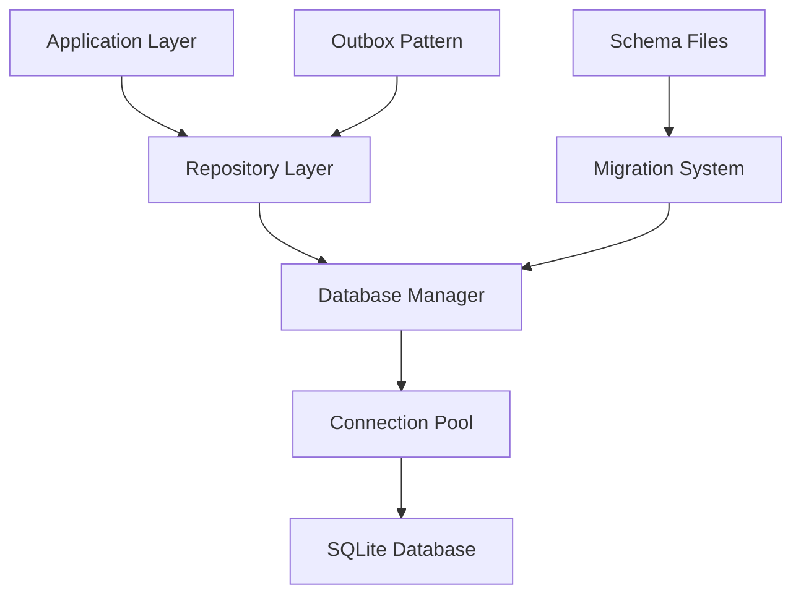

# Database Layer

The Database Layer provides high-performance data persistence using SQLite with WAL mode, connection pooling, and comprehensive migration support.

**Location**: `bot/db/sqlite.py:28`

## Overview

The database layer implements a production-ready SQLite solution with advanced features for concurrent access, data integrity, and performance optimization. It serves as the foundation for all persistent storage in the trading system.

### Key Features

- **SQLite with WAL Mode**: Write-Ahead Logging for better concurrency
- **Connection Pooling**: Async connection management with resource optimization
- **Migration System**: Automated schema versioning and updates
- **Repository Pattern**: Clean data access layer with domain models
- **Transaction Management**: ACID compliance with rollback support
- **Foreign Key Enforcement**: Data integrity constraints

## Architecture



## Core Components

### 1. SQLite Database Manager

**Location**: `bot/db/sqlite.py:28`

```python
class SQLiteManager:
    """
    SQLite database manager with connection pooling and migrations

    Features:
    - WAL mode for better concurrency
    - Automatic schema migrations
    - Connection pooling for async operations
    - Transaction management
    - Foreign key enforcement
    """

    def __init__(self, db_path: str | None = None):
        self.db_path = Path(db_path or settings.system.db_path)
        self.schema_path = Path(__file__).parent / "schema.sql"
        self._connection_pool: list[aiosqlite.Connection] = []
        self._pool_lock = asyncio.Lock()
        self._initialized = False
```

### 2. Connection Management

**WAL Mode Configuration**:

```python
async def initialize(self) -> None:
    """Initialize database with performance optimizations"""
    async with aiosqlite.connect(self.db_path) as conn:
        # Enable WAL mode for better concurrency
        await conn.execute("PRAGMA journal_mode=WAL")
        await conn.execute("PRAGMA synchronous=NORMAL")
        await conn.execute("PRAGMA cache_size=10000")
        await conn.execute("PRAGMA temp_store=memory")
        await conn.execute("PRAGMA foreign_keys=ON")
```

**Connection Pooling**:

```python
@asynccontextmanager
async def get_connection(self) -> AsyncGenerator[aiosqlite.Connection, None]:
    """Get connection from pool with automatic return"""
    async with self._pool_lock:
        if self._connection_pool:
            conn = self._connection_pool.pop()
        else:
            conn = await aiosqlite.connect(self.db_path)
            conn.row_factory = aiosqlite.Row
            await conn.execute("PRAGMA foreign_keys=ON")

    try:
        yield conn
    finally:
        # Return to pool if still usable
        if conn and not conn.in_transaction:
            async with self._pool_lock:
                if len(self._connection_pool) < 10:  # Max pool size
                    self._connection_pool.append(conn)
                else:
                    await conn.close()
        elif conn:
            await conn.close()
```

## Database Schema

### Core Tables

**Quotes Table**:

```sql
CREATE TABLE quotes (
    quote_id TEXT PRIMARY KEY,
    symbol_src TEXT NOT NULL,
    symbol_dst TEXT NOT NULL,
    bid_price REAL,
    bid_qty REAL,
    ask_price REAL,
    ask_qty REAL,
    status TEXT NOT NULL DEFAULT 'active',
    created_at REAL NOT NULL,
    expires_at REAL,
    source_bid_price REAL NOT NULL,
    source_ask_price REAL NOT NULL,
    spread_bps REAL,

    INDEX idx_quotes_status ON quotes(status),
    INDEX idx_quotes_created ON quotes(created_at),
    INDEX idx_quotes_expires ON quotes(expires_at)
);
```

**Orders Table**:

```sql
CREATE TABLE orders (
    order_id TEXT PRIMARY KEY,
    quote_id TEXT,
    symbol TEXT NOT NULL,
    side TEXT NOT NULL,
    type TEXT NOT NULL,
    quantity REAL NOT NULL,
    price REAL,
    status TEXT NOT NULL DEFAULT 'pending',
    external_order_id TEXT,
    created_at REAL NOT NULL,
    updated_at REAL NOT NULL,
    filled_quantity REAL DEFAULT 0,
    avg_fill_price REAL DEFAULT 0,

    FOREIGN KEY (quote_id) REFERENCES quotes(quote_id),
    INDEX idx_orders_status ON orders(status),
    INDEX idx_orders_symbol ON orders(symbol),
    INDEX idx_orders_created ON orders(created_at)
);
```

**Fills Table**:

```sql
CREATE TABLE fills (
    fill_id TEXT PRIMARY KEY,
    order_id TEXT NOT NULL,
    symbol TEXT NOT NULL,
    side TEXT NOT NULL,
    price REAL NOT NULL,
    quantity REAL NOT NULL,
    executed_at REAL NOT NULL,
    trade_id TEXT,
    commission REAL DEFAULT 0,
    commission_asset TEXT DEFAULT '',
    is_maker BOOLEAN DEFAULT TRUE,
    created_at REAL NOT NULL,
    status TEXT DEFAULT 'received',

    FOREIGN KEY (order_id) REFERENCES orders(order_id),
    INDEX idx_fills_order ON fills(order_id),
    INDEX idx_fills_symbol ON fills(symbol),
    INDEX idx_fills_executed ON fills(executed_at)
);
```

**Positions Table**:

```sql
CREATE TABLE positions (
    symbol TEXT PRIMARY KEY,
    quantity REAL NOT NULL DEFAULT 0,
    avg_entry_price REAL NOT NULL DEFAULT 0,
    realized_pnl REAL DEFAULT 0,
    unrealized_pnl REAL DEFAULT 0,
    last_updated REAL NOT NULL,

    INDEX idx_positions_updated ON positions(last_updated)
);
```

**Account Balances Table**:

```sql
CREATE TABLE account_balances (
    asset TEXT PRIMARY KEY,
    available REAL NOT NULL DEFAULT 0,
    locked REAL NOT NULL DEFAULT 0,
    total REAL NOT NULL DEFAULT 0,
    updated_at REAL NOT NULL,

    INDEX idx_balances_updated ON account_balances(updated_at)
);
```

**Outbox Table** (Event Sourcing):

```sql
CREATE TABLE outbox (
    event_id TEXT PRIMARY KEY,
    event_type TEXT NOT NULL,
    aggregate_id TEXT NOT NULL,
    payload TEXT NOT NULL,
    status TEXT NOT NULL DEFAULT 'pending',
    created_at REAL NOT NULL,
    processed_at REAL,
    retry_count INTEGER DEFAULT 0,
    error_message TEXT,

    INDEX idx_outbox_status ON outbox(status),
    INDEX idx_outbox_type ON outbox(event_type),
    INDEX idx_outbox_created ON outbox(created_at)
);
```

## Migration System

### Migration Runner

**Location**: `bot/db/sqlite.py:84`

```python
async def _run_migrations(self, conn: aiosqlite.Connection) -> None:
    """Run database schema migrations"""
    try:
        if not self.schema_path.exists():
            raise MigrationError(f"Schema file not found: {self.schema_path}")

        schema_sql = self.schema_path.read_text()

        # Execute schema in transaction
        await conn.executescript(schema_sql)

        logger.info("Database schema migrations completed")

    except Exception as e:
        raise MigrationError(f"Migration failed: {e}") from e
```

### Schema Versioning

**Future Enhancement**:

```python
# Schema version table for migration tracking
CREATE TABLE schema_version (
    version INTEGER PRIMARY KEY,
    applied_at REAL NOT NULL,
    description TEXT
);

# Migration file structure
migrations/
├── 001_initial_schema.sql
├── 002_add_positions_table.sql
├── 003_add_outbox_indices.sql
└── 004_account_balances.sql
```

## Repository Pattern

### Base Repository

**Location**: `bot/db/repo.py`

```python
from abc import ABC, abstractmethod
from typing import TypeVar, Generic, List, Optional

T = TypeVar('T')

class BaseRepository(Generic[T], ABC):
    """Base repository with common CRUD operations"""

    def __init__(self, db_manager: SQLiteManager):
        self.db = db_manager

    @abstractmethod
    async def create(self, entity: T) -> str:
        """Create new entity"""
        pass

    @abstractmethod
    async def get_by_id(self, entity_id: str) -> Optional[T]:
        """Get entity by ID"""
        pass

    @abstractmethod
    async def update(self, entity: T) -> bool:
        """Update existing entity"""
        pass

    @abstractmethod
    async def delete(self, entity_id: str) -> bool:
        """Delete entity by ID"""
        pass
```

### Quotes Repository

```python
class QuotesRepository(BaseRepository[Quote]):
    """Repository for quote management"""

    async def create(self, quote: Quote) -> str:
        """Create new quote"""
        query = """
        INSERT INTO quotes (
            quote_id, symbol_src, symbol_dst, bid_price, bid_qty,
            ask_price, ask_qty, status, created_at, expires_at,
            source_bid_price, source_ask_price, spread_bps
        ) VALUES (?, ?, ?, ?, ?, ?, ?, ?, ?, ?, ?, ?, ?)
        """

        async with self.db.get_connection() as conn:
            await conn.execute(query, (
                quote.quote_id,
                quote.symbol_src,
                quote.symbol_dst,
                float(quote.bid_price) if quote.bid_price else None,
                float(quote.bid_qty) if quote.bid_qty else None,
                float(quote.ask_price) if quote.ask_price else None,
                float(quote.ask_qty) if quote.ask_qty else None,
                quote.status,
                quote.created_at,
                quote.expires_at,
                quote.source_bid_price,
                quote.source_ask_price,
                quote.spread_bps,
            ))
            await conn.commit()

        return quote.quote_id

    async def get_active_quotes(self, symbol: str = None) -> List[Quote]:
        """Get all active quotes, optionally filtered by symbol"""
        query = """
        SELECT * FROM quotes
        WHERE status = 'active'
        AND (expires_at IS NULL OR expires_at > ?)
        """
        params = [time.time()]

        if symbol:
            query += " AND symbol_dst = ?"
            params.append(symbol)

        query += " ORDER BY created_at DESC"

        async with self.db.get_connection() as conn:
            cursor = await conn.execute(query, params)
            rows = await cursor.fetchall()
            return [self._row_to_quote(row) for row in rows]

    async def expire_quote(self, quote_id: str) -> bool:
        """Mark quote as expired"""
        query = """
        UPDATE quotes
        SET status = 'expired', updated_at = ?
        WHERE quote_id = ? AND status = 'active'
        """

        async with self.db.get_connection() as conn:
            cursor = await conn.execute(query, (time.time(), quote_id))
            await conn.commit()
            return cursor.rowcount > 0
```

### Orders Repository

```python
class OrdersRepository(BaseRepository[Order]):
    """Repository for order management"""

    async def create(self, order: Order) -> str:
        """Create new order"""
        query = """
        INSERT INTO orders (
            order_id, quote_id, symbol, side, type, quantity, price,
            status, created_at, updated_at
        ) VALUES (?, ?, ?, ?, ?, ?, ?, ?, ?, ?)
        """

        async with self.db.get_connection() as conn:
            await conn.execute(query, (
                order.order_id,
                order.quote_id,
                order.symbol,
                order.side,
                order.type,
                float(order.quantity),
                float(order.price) if order.price else None,
                order.status,
                order.created_at,
                order.updated_at,
            ))
            await conn.commit()

        return order.order_id

    async def update_status(self, order_id: str, status: str,
                          external_order_id: str = None) -> bool:
        """Update order status and external ID"""
        query = """
        UPDATE orders
        SET status = ?, external_order_id = ?, updated_at = ?
        WHERE order_id = ?
        """

        async with self.db.get_connection() as conn:
            cursor = await conn.execute(query, (
                status, external_order_id, time.time(), order_id
            ))
            await conn.commit()
            return cursor.rowcount > 0

    async def get_by_external_id(self, external_order_id: str) -> Optional[Order]:
        """Get order by external exchange order ID"""
        query = """
        SELECT * FROM orders WHERE external_order_id = ?
        """

        async with self.db.get_connection() as conn:
            cursor = await conn.execute(query, (external_order_id,))
            row = await cursor.fetchone()
            return self._row_to_order(row) if row else None
```

## Outbox Pattern Implementation

### Outbox Repository

```python
class OutboxRepository:
    """Repository for event sourcing outbox pattern"""

    def __init__(self, db_manager: SQLiteManager):
        self.db = db_manager

    async def add_event(self, event_type: str, aggregate_id: str,
                       payload: dict) -> str:
        """Add new event to outbox"""
        import uuid
        import json

        event_id = str(uuid.uuid4())

        query = """
        INSERT INTO outbox (
            event_id, event_type, aggregate_id, payload,
            status, created_at
        ) VALUES (?, ?, ?, ?, 'pending', ?)
        """

        async with self.db.get_connection() as conn:
            await conn.execute(query, (
                event_id,
                event_type,
                aggregate_id,
                json.dumps(payload),
                time.time(),
            ))
            await conn.commit()

        return event_id

    async def get_pending_events(self, limit: int = 100) -> List[dict]:
        """Get pending events for processing"""
        query = """
        SELECT * FROM outbox
        WHERE status = 'pending'
        ORDER BY created_at ASC
        LIMIT ?
        """

        async with self.db.get_connection() as conn:
            cursor = await conn.execute(query, (limit,))
            rows = await cursor.fetchall()

            return [{
                'event_id': row['event_id'],
                'event_type': row['event_type'],
                'aggregate_id': row['aggregate_id'],
                'payload': json.loads(row['payload']),
                'created_at': row['created_at'],
                'retry_count': row['retry_count'],
            } for row in rows]

    async def mark_processed(self, event_id: str) -> bool:
        """Mark event as successfully processed"""
        query = """
        UPDATE outbox
        SET status = 'processed', processed_at = ?
        WHERE event_id = ? AND status = 'pending'
        """

        async with self.db.get_connection() as conn:
            cursor = await conn.execute(query, (time.time(), event_id))
            await conn.commit()
            return cursor.rowcount > 0

    async def mark_failed(self, event_id: str, error_message: str) -> bool:
        """Mark event as failed with error message"""
        query = """
        UPDATE outbox
        SET status = 'failed', retry_count = retry_count + 1,
            error_message = ?, processed_at = ?
        WHERE event_id = ?
        """

        async with self.db.get_connection() as conn:
            cursor = await conn.execute(query, (
                error_message, time.time(), event_id
            ))
            await conn.commit()
            return cursor.rowcount > 0
```

## Transaction Management

### Transaction Context Manager

```python
@asynccontextmanager
async def transaction(self) -> AsyncGenerator[aiosqlite.Connection, None]:
    """Database transaction with automatic rollback on error"""
    async with self.get_connection() as conn:
        try:
            await conn.execute("BEGIN")
            yield conn
            await conn.commit()
        except Exception:
            await conn.rollback()
            raise
```

### Usage Example

```python
# Atomic operations with rollback
async def process_fill_with_transaction(fill: Fill, position_update: PositionUpdate):
    async with db_manager.transaction() as conn:
        # All operations succeed or all rollback
        await fills_repo.create(fill)
        await positions_repo.update(position_update)
        await outbox_repo.add_event("fill_processed", fill.fill_id, {
            "fill_id": fill.fill_id,
            "order_id": fill.order_id,
        })
```

## Performance Optimization

### Index Strategy

**Primary Indices**:

- All tables have primary key indices (automatic)
- Foreign key columns indexed for join performance
- Status columns indexed for filtering

**Query-Specific Indices**:

```sql
-- Optimize active quote queries
CREATE INDEX idx_quotes_active ON quotes(status, expires_at);

-- Optimize order history queries
CREATE INDEX idx_orders_symbol_status ON orders(symbol, status, created_at);

-- Optimize fill lookup by order
CREATE INDEX idx_fills_order_executed ON fills(order_id, executed_at);

-- Optimize outbox processing
CREATE INDEX idx_outbox_pending ON outbox(status, created_at);
```

### Query Optimization

**Prepared Statements**: All repositories use parameterized queries
**Batch Operations**: Support for bulk inserts and updates
**Connection Reuse**: Connection pooling reduces overhead
**Row Factory**: aiosqlite.Row for dict-like access without overhead

### WAL Mode Benefits

| Feature                | Traditional | WAL Mode         |
| ---------------------- | ----------- | ---------------- |
| **Reader Blocking**    | Yes         | No               |
| **Writer Blocking**    | Yes         | Reduced          |
| **Concurrent Reads**   | Limited     | Full             |
| **Crash Recovery**     | Rollback    | Forward recovery |
| **Checkpoint Control** | Automatic   | Configurable     |

## Database Administration

### Maintenance Operations

```python
async def maintain_database():
    """Perform database maintenance tasks"""

    # Get database size statistics
    stats = await db_manager.get_database_size()
    logger.info("Database size", **stats)

    # Vacuum if needed (reclaim space)
    if stats["total_size_mb"] > 100:  # > 100MB
        await db_manager.vacuum()

    # Update statistics for query optimization
    await db_manager.analyze()

    # Cleanup old data
    await cleanup_old_quotes()
    await cleanup_processed_outbox_events()
```

### Data Retention

```python
async def cleanup_old_quotes(retention_days: int = 7):
    """Clean up old expired quotes"""
    cutoff = time.time() - (retention_days * 86400)

    query = """
    DELETE FROM quotes
    WHERE status IN ('expired', 'cancelled')
    AND created_at < ?
    """

    async with db_manager.get_connection() as conn:
        cursor = await conn.execute(query, (cutoff,))
        deleted = cursor.rowcount
        await conn.commit()

    logger.info(f"Cleaned up {deleted} old quotes")

async def cleanup_processed_outbox_events(retention_days: int = 30):
    """Clean up processed outbox events"""
    cutoff = time.time() - (retention_days * 86400)

    query = """
    DELETE FROM outbox
    WHERE status = 'processed'
    AND processed_at < ?
    """

    async with db_manager.get_connection() as conn:
        cursor = await conn.execute(query, (cutoff,))
        deleted = cursor.rowcount
        await conn.commit()

    logger.info(f"Cleaned up {deleted} processed events")
```

## Configuration

### Database Settings

```yaml
database:
  path: "trading_bot.db" # Database file path
  wal_mode: true # Enable WAL mode
  connection_pool_size: 10 # Max connections in pool
  query_timeout: 30 # Query timeout in seconds

  # Retention policies
  quote_retention_days: 7 # Quote history retention
  fill_retention_days: 90 # Fill history retention
  outbox_retention_days: 30 # Outbox event retention

  # Performance tuning
  cache_size: 10000 # SQLite cache size (pages)
  temp_store: "memory" # Store temp data in memory
  synchronous: "NORMAL" # Balance safety and performance
```

### Environment Variables

```bash
# Database configuration
DB_PATH="trading_bot.db"
DB_CONNECTION_POOL_SIZE=10
DB_QUERY_TIMEOUT=30

# Maintenance
DB_AUTO_VACUUM=true
DB_CHECKPOINT_INTERVAL=300  # Seconds
```

## Monitoring & Health Checks

### Database Health Monitoring

```python
async def check_database_health():
    """Comprehensive database health check"""
    health = {
        "connected": False,
        "wal_mode": False,
        "foreign_keys": False,
        "pool_size": 0,
        "size_mb": 0,
    }

    try:
        async with db_manager.get_connection() as conn:
            health["connected"] = True

            # Check WAL mode
            cursor = await conn.execute("PRAGMA journal_mode")
            mode = await cursor.fetchone()
            health["wal_mode"] = mode[0].upper() == "WAL"

            # Check foreign keys
            cursor = await conn.execute("PRAGMA foreign_keys")
            fk = await cursor.fetchone()
            health["foreign_keys"] = bool(fk[0])

        # Get pool and size info
        health["pool_size"] = len(db_manager._connection_pool)
        size_stats = await db_manager.get_database_size()
        health["size_mb"] = size_stats["total_size_mb"]

    except Exception as e:
        logger.error("Database health check failed", error=str(e))

    return health
```

## Usage Examples

### Basic Repository Usage

```python
from bot.db.sqlite import db_manager
from bot.db.repo import QuotesRepository, OrdersRepository

# Initialize repositories
quotes_repo = QuotesRepository(db_manager)
orders_repo = OrdersRepository(db_manager)

# Create new quote
quote = Quote(
    quote_id="quote_123",
    symbol_src="ADAUSDT",
    symbol_dst="ADAUSDM",
    bid_price=0.44,
    ask_price=0.45,
    # ... other fields
)

quote_id = await quotes_repo.create(quote)

# Query active quotes
active_quotes = await quotes_repo.get_active_quotes("ADAUSDM")

# Create order from quote
order = Order(
    order_id="order_456",
    quote_id=quote_id,
    symbol="ADAUSDM",
    side="buy",
    # ... other fields
)

await orders_repo.create(order)
```

### Transaction Usage

```python
# Multi-table transaction
async def process_quote_to_order(quote: Quote, order: Order):
    async with db_manager.transaction() as conn:
        # Create order
        await orders_repo.create(order)

        # Update quote status
        await quotes_repo.update_status(quote.quote_id, "used")

        # Add outbox event
        await outbox_repo.add_event("order_created", order.order_id, {
            "order_id": order.order_id,
            "quote_id": quote.quote_id,
        })

        # All succeed or all rollback
```

The Database Layer provides a solid foundation for the trading system with production-ready features for data persistence, integrity, and performance.
