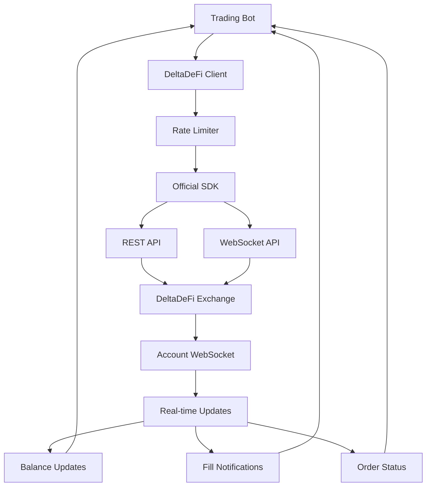

# DeltaDeFi Integration

The DeltaDeFi Integration module provides comprehensive connectivity to the DeltaDeFi exchange through REST APIs and WebSocket feeds using the official Python SDK.

**Location**: `bot/deltadefi.py:23`

## Overview

This module serves as the primary interface to DeltaDeFi exchange, handling order execution, account management, and real-time data feeds with proper error handling and rate limiting.

### Key Features

- **Official SDK Integration**: Uses the deltadefi Python SDK for robust API access
- **Rate Limiting**: Token bucket rate limiter respecting 5 orders/second limit
- **Order Workflow**: Complete build → sign → submit process with error handling
- **WebSocket Feeds**: Real-time account updates, fills, and market data
- **Network Abstraction**: Seamless testnet/mainnet switching
- **Operation Key Management**: Secure trading password handling

## Architecture



## Core Components

### 1. DeltaDeFi Client

**Location**: `bot/deltadefi.py:23`

```python
class DeltaDeFiClient:
    """DeltaDeFi client wrapper with rate limiting and error handling"""

    def __init__(
        self,
        api_key: str | None = None,
        trading_password: str | None = None,
        network: str | None = None,
        rate_limiter: TokenBucketRateLimiter | None = None,
    ):
        self.api_key = api_key or settings.exchange.deltadefi_api_key
        self.trading_password = trading_password or settings.exchange.trading_password

        # Map system mode to SDK network parameter
        system_mode = settings.system.mode.lower()
        if network:
            self.network = network
        elif system_mode in ["testnet", "preprod", "staging"]:
            self.network = "preprod"
        elif system_mode == "mainnet":
            self.network = "mainnet"
        else:
            self.network = "preprod"  # Default to testnet
```

**Key Features**:

- **Automatic Network Selection**: Maps configuration mode to SDK network
- **Rate Limiting Integration**: Configurable token bucket rate limiter
- **Operation Key Loading**: Secure password-based key management
- **Error Handling**: Comprehensive exception handling and logging

### 2. SDK Integration

**Official SDK Usage**:

```python
from deltadefi import ApiClient

# Initialize SDK client
self._client = ApiClient(
    network=self.network,
    api_key=self.api_key,
)

# Load operation key for trading
if self.trading_password:
    self._client.load_operation_key(self.trading_password)
    self._operation_key_loaded = True
```

**Network Configuration**:

- **Testnet/Preprod**: `network="preprod"`
- **Mainnet**: `network="mainnet"`
- **Auto-detection**: Based on `system.mode` setting

### 3. Order Management

**Order Submission Flow**:

```python
async def submit_order(
    self,
    symbol: str,
    side: str,
    order_type: str,
    quantity: int,
    price: float | None = None,
    **kwargs,
) -> dict:
    """Submit order with rate limiting and error handling"""

    if not self._operation_key_loaded:
        raise ValueError("Operation key not loaded - cannot submit orders")

    # Wait for rate limit token
    await self.rate_limiter.wait_for_token()

    logger.info(
        "Submitting order",
        symbol=symbol,
        side=side,
        type=order_type,
        quantity=quantity,
        price=price,
    )

    try:
        # SDK handles build/sign/submit workflow
        result = self._client.post_order(
            symbol=symbol,
            side=side,
            type=order_type,
            quantity=quantity,
            price=price,
            **kwargs,
        )

        logger.info("Order submitted successfully", result=result)
        return result

    except Exception as e:
        logger.error("Failed to submit order", error=str(e))
        raise
```

### 4. Account Data Retrieval

**Balance Queries**:

```python
async def get_account_balance(self) -> dict:
    """Get current account balances"""
    try:
        balance = self._client.accounts.get_account_balance()
        logger.info("Account balance retrieved", balance=balance)
        return balance
    except Exception as e:
        logger.error("Failed to get account balance", error=str(e))
        raise
```

**Market Data**:

```python
async def get_market_price(self, symbol: str) -> dict:
    """Get current market price for symbol"""
    try:
        price = self._client.markets.get_market_price(symbol)
        logger.debug("Market price retrieved", symbol=symbol, price=price)
        return price
    except Exception as e:
        logger.error("Failed to get market price", symbol=symbol, error=str(e))
        raise
```

## WebSocket Integration

### Account WebSocket

**Location**: `bot/deltadefi.py:262`

```python
class AccountWebSocket:
    """WebSocket client for real-time account updates using DeltaDeFi SDK"""

    def __init__(
        self,
        api_client: Any | None = None,
        network: str = "preprod",
        api_key: str | None = None,
    ):
        self.api_key = api_key or settings.exchange.deltadefi_api_key

        if api_client:
            self._client = api_client
        else:
            self._client = ApiClient(
                network=network,
                api_key=self.api_key,
            )

        self._account_callbacks: list[Callable] = []
        self._running = False
```

**Subscription Management**:

```python
async def start(self) -> None:
    """Start WebSocket connection and subscribe to account updates"""
    if not self.api_key:
        raise ValueError("API key is required for account WebSocket")

    self._running = True

    try:
        # Register account message handler
        self._client.websocket.register_handler(
            "account", self._handle_account_message
        )

        # Subscribe to account stream
        await self._client.websocket.subscribe_account()

        logger.info("Account WebSocket started and subscribed")

    except Exception as e:
        logger.error("Failed to start account WebSocket", error=str(e))
        raise
```

### Message Processing

**Account Update Handler**:

```python
async def _handle_account_message(self, data: dict) -> None:
    """Handle incoming account WebSocket messages"""
    try:
        sub_type = data.get("sub_type", "unknown")
        logger.info(
            "Account update received",
            sub_type=sub_type,
            data_keys=list(data.keys()) if isinstance(data, dict) else "non-dict",
        )

        # Call all registered callbacks
        for callback in self._account_callbacks:
            try:
                if asyncio.iscoroutinefunction(callback):
                    await callback(data)
                else:
                    callback(data)
            except Exception as e:
                logger.error(
                    "Error in account callback",
                    callback=callback.__name__,
                    error=str(e),
                )

    except Exception as e:
        logger.error("Error handling account message", error=str(e), data=data)
```

**Callback Registration**:

```python
def add_account_callback(self, callback: Callable) -> None:
    """Add callback for account updates (balances, fills, order status)"""
    self._account_callbacks.append(callback)
    logger.debug("Account callback added", callback=callback.__name__)
```

### Market Data WebSocket

**Location**: `bot/deltadefi.py:380`

```python
class MarketDataWebSocket:
    """WebSocket client for market data using DeltaDeFi SDK"""

    def __init__(self, api_client: Any | None = None, network: str = "preprod"):
        if api_client:
            self._client = api_client
        else:
            self._client = ApiClient(network=network, api_key=self.api_key)

        self._trade_callbacks: list[Callable] = []
        self._depth_callbacks: list[Callable] = []
        self._price_callbacks: list[Callable] = []
```

**Market Data Subscriptions**:

```python
# Subscribe to different data streams
await market_ws.subscribe_trades("ADAUSDM")    # Trade executions
await market_ws.subscribe_depth("ADAUSDM")     # Order book depth
await market_ws.subscribe_price("ADAUSDM")     # Price updates
```

## Rate Limiting

### Token Bucket Integration

**Rate Limiter Setup**:

```python
self.rate_limiter = rate_limiter or TokenBucketRateLimiter(
    max_tokens=int(settings.system.max_orders_per_second),
    refill_rate=settings.system.max_orders_per_second,
)
```

**Order Submission with Rate Limiting**:

```python
async def submit_order(self, ...):
    # Block until rate limit allows
    await self.rate_limiter.wait_for_token()

    # Proceed with order submission
    result = self._client.post_order(...)
    return result
```

**Cancel Orders with Rate Limiting**:

```python
async def cancel_order(self, order_id: str, **kwargs) -> dict:
    await self.rate_limiter.wait_for_token()

    try:
        result = self._client.cancel_order(order_id=order_id, **kwargs)
        logger.info("Order cancelled successfully", order_id=order_id)
        return result
    except Exception as e:
        logger.error("Failed to cancel order", order_id=order_id, error=str(e))
        raise
```

## Error Handling

### Exception Hierarchy

**Client Errors**:

```python
try:
    result = await deltadefi_client.submit_order(...)
except ValueError as e:
    # Configuration or parameter errors
    logger.error("Invalid order parameters", error=str(e))
except Exception as e:
    # Network, API, or other errors
    logger.error("Order submission failed", error=str(e))
    raise
```

**WebSocket Errors**:

```python
async def _handle_websocket_error(self, error):
    """Handle WebSocket connection errors"""
    logger.error("WebSocket error occurred", error=str(error))

    # Attempt reconnection with backoff
    await asyncio.sleep(5)

    if self._running:
        try:
            await self.start()
        except Exception as e:
            logger.error("Reconnection failed", error=str(e))
```

### Retry Logic

**Exponential Backoff**:

```python
async def submit_order_with_retry(self, max_retries: int = 3, **order_params):
    """Submit order with exponential backoff retry"""

    for attempt in range(max_retries):
        try:
            return await self.submit_order(**order_params)

        except Exception as e:
            if attempt == max_retries - 1:
                raise  # Last attempt failed

            wait_time = 2 ** attempt  # Exponential backoff
            logger.warning(
                "Order submission failed, retrying",
                attempt=attempt + 1,
                wait_time=wait_time,
                error=str(e),
            )
            await asyncio.sleep(wait_time)
```

## Configuration

### Network Configuration

```yaml
exchange:
  deltadefi_api_key: "your_api_key_here"
  trading_password: "your_trading_password"

system:
  mode: "testnet" # testnet|mainnet
  max_orders_per_second: 5 # Rate limit
```

**Network Mapping**:

- `mode: "testnet"` → `network="preprod"`
- `mode: "mainnet"` → `network="mainnet"`
- `mode: "staging"` → `network="preprod"`

### Environment Variables

```bash
# DeltaDeFi Configuration
DELTADEFI_API_KEY="your_api_key_here"
TRADING_PASSWORD="your_trading_password"
SYSTEM_MODE="testnet"
MAX_ORDERS_PER_SECOND="5"
```

## API Reference

### DeltaDeFi Client

```python
# Initialize client
client = DeltaDeFiClient(
    api_key="your_key",
    trading_password="your_password",
    network="preprod"
)

# Account operations
balance = await client.get_account_balance()
price = await client.get_market_price("ADAUSDM")

# Trading operations
order_result = await client.submit_order(
    symbol="ADAUSDM",
    side="buy",
    order_type="limit",
    quantity=100,
    price=0.45
)

cancel_result = await client.cancel_order("order_id_123")
```

### WebSocket Clients

```python
# Account WebSocket
account_ws = AccountWebSocket(api_key="your_key", network="preprod")
account_ws.add_account_callback(handle_account_update)
await account_ws.start()

# Market Data WebSocket
market_ws = MarketDataWebSocket(network="preprod")
market_ws.add_trade_callback(handle_trade_update)
await market_ws.subscribe_trades("ADAUSDM")
```

## Usage Examples

### Basic Order Submission

```python
from bot.deltadefi import DeltaDeFiClient
from bot.rate_limiter import TokenBucketRateLimiter

# Setup client with rate limiting
rate_limiter = TokenBucketRateLimiter(max_tokens=5, refill_rate=5.0)
client = DeltaDeFiClient(rate_limiter=rate_limiter)

# Submit limit order
try:
    result = await client.submit_order(
        symbol="ADAUSDM",
        side="buy",
        order_type="limit",
        quantity=100,
        price=0.45
    )

    print(f"Order submitted: {result}")

except ValueError as e:
    print(f"Invalid order: {e}")
except Exception as e:
    print(f"Submission failed: {e}")
```

### Account Monitoring

```python
from bot.deltadefi import AccountWebSocket

async def handle_account_update(data):
    """Process account updates"""
    update_type = data.get("type", "")

    if update_type == "balance_update":
        print(f"Balance updated: {data}")
    elif update_type == "fill":
        print(f"Fill received: {data}")
    elif update_type == "order_update":
        print(f"Order status: {data}")

# Setup account WebSocket
account_ws = AccountWebSocket()
account_ws.add_account_callback(handle_account_update)
await account_ws.start()

print("Monitoring account updates...")
```

### Market Data Integration

```python
async def handle_price_update(data):
    """Process price updates"""
    symbol = data.get("symbol")
    price = data.get("price")
    print(f"{symbol} price: {price}")

# Subscribe to market data
market_ws = MarketDataWebSocket()
market_ws.add_price_callback(handle_price_update)
await market_ws.subscribe_price("ADAUSDM")
```

### Integration with Trading Bot

**Main Bot Integration**:

```python
# In TradingBot main class
async def _initialize_components(self):
    # Initialize DeltaDeFi client
    self.deltadefi_client = DeltaDeFiClient(
        rate_limiter=TokenBucketRateLimiter(
            max_tokens=int(settings.system.max_orders_per_second),
            refill_rate=settings.system.max_orders_per_second,
        )
    )

    # Initialize account manager with WebSocket
    self.account_manager = AccountManager(self.deltadefi_client)
```

**Order Pipeline Integration**:

```python
# In quote-to-order pipeline
async def submit_order_to_exchange(self, order):
    """Submit order through DeltaDeFi client"""
    try:
        result = await self.deltadefi_client.submit_order(
            symbol=order.symbol,
            side=order.side,
            order_type=order.order_type,
            quantity=int(order.quantity),
            price=float(order.price)
        )

        # Update order with external ID
        await self.oms.update_order_state(
            order.order_id,
            OrderState.WORKING,
            external_order_id=result.get("order_id")
        )

        return result

    except Exception as e:
        await self.oms.update_order_state(
            order.order_id,
            OrderState.FAILED,
            error_message=str(e)
        )
        raise
```

## Monitoring & Health Checks

### Connection Health

```python
async def check_deltadefi_health():
    """Check DeltaDeFi connectivity and authentication"""
    health = {
        "rest_api": False,
        "websocket": False,
        "authenticated": False,
        "operation_key": False,
    }

    try:
        # Test REST API
        balance = await client.get_account_balance()
        health["rest_api"] = True
        health["authenticated"] = True

        # Check operation key
        health["operation_key"] = client._operation_key_loaded

        # Check WebSocket
        health["websocket"] = account_ws.is_connected if account_ws else False

    except Exception as e:
        logger.error("DeltaDeFi health check failed", error=str(e))

    return health
```

### Rate Limiter Status

```python
# Monitor rate limiting
rate_limit_status = client.rate_limiter.get_status()
logger.info("Rate limiter status", **rate_limit_status)

if rate_limit_status["utilization"] > 0.8:
    logger.warning("High rate limit utilization")
```

## Security Considerations

### API Key Management

- **Environment Variables**: Store API keys in environment variables
- **No Hardcoding**: Never hardcode credentials in source code
- **Rotation**: Support for API key rotation without restart

### Operation Key Security

- **Memory Only**: Operation keys exist only in memory
- **No Logging**: Never log trading passwords or operation keys
- **Secure Loading**: Use secure password input methods

### Network Security

- **TLS/SSL**: All communications use HTTPS/WSS
- **Certificate Validation**: Verify exchange certificates
- **Rate Limiting**: Prevent abuse through rate limiting

The DeltaDeFi Integration module provides a robust, secure, and efficient interface to the DeltaDeFi exchange with comprehensive error handling, rate limiting, and real-time capabilities essential for professional trading operations.
