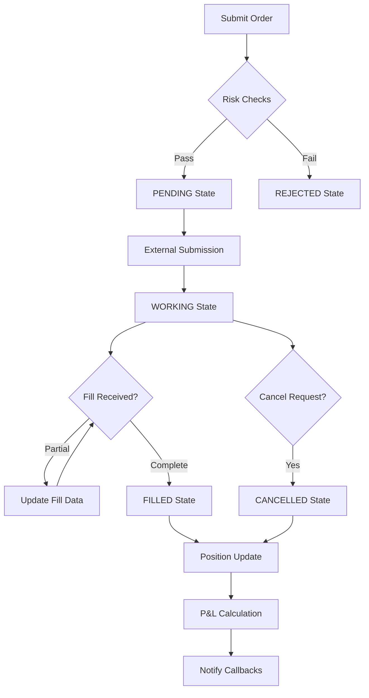

# Order Management System (OMS)

The Order Management System is the core component responsible for order lifecycle management, risk controls, and position tracking. It implements a comprehensive state machine with built-in risk management and portfolio tracking.

**Location**: `bot/oms.py:209`

## Overview

The OMS provides a centralized system for managing all trading orders from creation to completion, with comprehensive risk management and position tracking capabilities.

### Key Features

- **State Machine**: Complete order lifecycle with validated state transitions
- **Risk Management**: Real-time position and exposure monitoring
- **Position Tracking**: Multi-asset portfolio with P&L calculations
- **Fill Processing**: Automatic position updates from trade executions
- **Event System**: Callback-based notifications for order and position changes

## Architecture



## Core Components

### 1. Order State Machine

**Location**: `bot/oms.py:25`

The OMS implements a strict state machine for order lifecycle management:

```python
class OrderState(str, Enum):
    IDLE = "idle"           # Initial state before submission
    PENDING = "pending"     # Submitted for processing
    WORKING = "working"     # Active in market
    FILLED = "filled"       # Completely executed
    CANCELLED = "cancelled" # User or system cancelled
    REJECTED = "rejected"   # Rejected by exchange or risk
    FAILED = "failed"       # Technical failure
```

**State Transitions**:

- `IDLE → [PENDING, REJECTED]`
- `PENDING → [WORKING, REJECTED, FAILED]`
- `WORKING → [FILLED, CANCELLED, REJECTED]`
- Terminal states cannot transition further

### 2. Order Data Structure

**Location**: `bot/oms.py:95`

```python
@dataclass
class OMSOrder:
    order_id: str
    symbol: str
    side: OrderSide              # BUY or SELL
    order_type: OrderType        # LIMIT or MARKET
    quantity: Decimal
    price: Decimal | None
    state: OrderState
    filled_quantity: Decimal = Decimal("0")
    avg_fill_price: Decimal = Decimal("0")
    external_order_id: str | None = None
    fills: list[dict] = field(default_factory=list)
```

**Key Properties**:

- `remaining_quantity`: Unfilled portion of order
- `is_complete`: Whether order is in terminal state
- `fill_ratio`: Percentage of order filled (0.0 to 1.0)

### 3. Position Tracking

**Location**: `bot/oms.py:63`

```python
@dataclass
class Position:
    symbol: str
    quantity: Decimal           # Signed quantity (+ long, - short)
    avg_price: Decimal         # Volume-weighted average price
    realized_pnl: Decimal      # Realized profit/loss
    unrealized_pnl: Decimal    # Mark-to-market P&L
    last_update: float
```

**Position Calculations**:

- **FIFO/LIFO Support**: Configurable position accounting
- **Average Price Updates**: Volume-weighted calculations
- **P&L Tracking**: Real-time realized and unrealized P&L
- **Multi-Asset**: Independent tracking per trading symbol

### 4. Risk Management

**Location**: `bot/oms.py:136`

The integrated risk manager performs comprehensive pre-trade and ongoing risk checks:

```python
class RiskManager:
    def check_risk(self, order: OMSOrder, position: Position) -> tuple[bool, list[str]]
```

**Risk Checks**:

| Check Type         | Description                   | Configuration            |
| ------------------ | ----------------------------- | ------------------------ |
| **Position Size**  | Maximum position per symbol   | `risk.max_position_size` |
| **Daily Loss**     | Daily P&L limit               | `risk.max_daily_loss`    |
| **Position Skew**  | Maximum directional exposure  | `trading.max_skew`       |
| **Order Quantity** | Minimum order size validation | `trading.min_quote_size` |
| **Open Orders**    | Maximum concurrent orders     | Hard-coded limit (10)    |
| **Emergency Stop** | Global trading halt           | `risk.emergency_stop`    |

## API Reference

### Order Management

```python
# Submit new order with risk validation
async def submit_order(
    symbol: str,
    side: OrderSide,
    order_type: OrderType,
    quantity: Decimal,
    price: Decimal | None = None,
    order_id: str | None = None,
) -> OMSOrder

# Update order state with validation
async def update_order_state(
    order_id: str,
    new_state: OrderState,
    **kwargs
)

# Process fill and update position
async def add_fill(
    order_id: str,
    fill_quantity: Decimal,
    fill_price: Decimal,
    trade_id: str | None = None,
    fee: Decimal = Decimal("0"),
)

# Cancel active order
async def cancel_order(order_id: str, reason: str = "User requested")
```

### Position Management

```python
# Get current position for symbol
def get_position(symbol: str) -> Position | None

# Get all positions
def get_all_positions() -> list[Position]

# Get portfolio summary
def get_portfolio_summary() -> dict
```

### Order Queries

```python
# Get specific order
def get_order(order_id: str) -> OMSOrder | None

# Get orders with filters
def get_all_orders(symbol: str | None = None, state: OrderState | None = None) -> list[OMSOrder]

# Get active orders
def get_open_orders(symbol: str | None = None) -> list[OMSOrder]
```

## Event System

The OMS provides callback-based event notifications for real-time updates:

### Order Events

```python
# Register order event callback
oms.add_order_callback(async def on_order_update(order: OMSOrder):
    print(f"Order {order.order_id} state changed to {order.state}")
)
```

**Order Event Data**:

- Order ID and external order ID
- State transition information
- Fill data and quantities
- Error messages for failures

### Position Events

```python
# Register position event callback
oms.add_position_callback(async def on_position_update(position: Position):
    print(f"Position {position.symbol}: {position.quantity} @ {position.avg_price}")
)
```

**Position Event Data**:

- Symbol and quantity changes
- Average price updates
- Realized P&L calculations
- Risk metrics

## Fill Process

### Fill Validation

The OMS performs comprehensive validation on all fills:

1. **Order Existence**: Verify order exists and is active
2. **Quantity Validation**: Ensure fill doesn't exceed order size
3. **Price Reasonableness**: Validate fill price within expected ranges
4. **Duplicate Prevention**: Check for duplicate trade IDs

### Position Updates

**Average Price Calculation**:

```python
# Adding to position
if (current_qty > 0 and fill_side == BUY) or (current_qty < 0 and fill_side == SELL):
    old_notional = current_qty * current_avg_price
    new_notional = old_notional + (fill_qty * fill_price)
    new_avg_price = new_notional / (current_qty + fill_qty)

# Reducing position - realize P&L
else:
    realized_pnl = fill_qty * (fill_price - current_avg_price)
```

**P&L Calculation**:

- **Realized P&L**: Calculated on position reductions
- **Unrealized P&L**: Mark-to-market based on current prices
- **Fee Accounting**: Trading fees reduce realized P&L

## Risk Management Details

### Position Size Limits

```python
# Maximum position validation
new_position_size = abs(current_position.quantity)
if order.side == OrderSide.BUY:
    new_position_size += order.quantity
else:
    new_position_size = abs(current_position.quantity - order.quantity)

if new_position_size > Decimal(str(settings.risk.max_position_size)):
    violations.append("Position size limit exceeded")
```

### Daily Loss Tracking

```python
# Daily P&L monitoring with midnight reset
def _update_daily_pnl(self):
    current_time = time.time()
    if current_time - self.daily_pnl_reset_time > 86400:  # 24 hours
        self.daily_pnl = Decimal("0")
        self.daily_pnl_reset_time = current_time
```

## Usage Examples

### Basic Order Submission

```python
from bot.oms import OrderManagementSystem, OrderSide, OrderType
from decimal import Decimal

oms = OrderManagementSystem()

# Submit buy order with risk validation
try:
    order = await oms.submit_order(
        symbol="ADAUSDM",
        side=OrderSide.BUY,
        order_type=OrderType.LIMIT,
        quantity=Decimal("100"),
        price=Decimal("0.45")
    )
    print(f"Order submitted: {order.order_id}")

except ValueError as e:
    print(f"Order rejected: {e}")
```

### Fill Processing

```python
# Process fill from external source
await oms.add_fill(
    order_id="order_123",
    fill_quantity=Decimal("50"),
    fill_price=Decimal("0.451"),
    trade_id="trade_456",
    fee=Decimal("0.01")
)

# Check updated order status
order = oms.get_order("order_123")
print(f"Fill ratio: {order.fill_ratio:.1%}")
print(f"Remaining: {order.remaining_quantity}")
```

### Portfolio Monitoring

```python
# Get portfolio summary
portfolio = oms.get_portfolio_summary()
print(f"Total positions: {portfolio['total_positions']}")
print(f"Open orders: {portfolio['open_orders']}")
print(f"Daily P&L: {portfolio['daily_pnl']}")

# Check specific position
position = oms.get_position("ADAUSDM")
if position:
    print(f"Position: {position.quantity} ADA")
    print(f"Average price: ${position.avg_price}")
    print(f"Unrealized P&L: ${position.unrealized_pnl}")
```

## Integration Points

### Quote-to-Order Pipeline Integration

**Location**: `bot/quote_to_order_pipeline.py:45`

The OMS integrates with the quote pipeline for automated order management:

```python
# Pipeline submits orders through OMS
order = await self.oms.submit_order(
    symbol=quote.symbol,
    side=side,
    order_type=OrderType.LIMIT,
    quantity=Decimal(str(quote.bid_qty)),
    price=Decimal(str(quote.bid_price))
)
```

### Account Manager Integration

**Location**: `bot/account_manager.py:572`

The Account Manager feeds fills into the OMS:

```python
# Account manager processes fills
await self.oms.add_fill(
    order_id=fill.order_id,
    fill_quantity=fill.quantity,
    fill_price=fill.price,
    trade_id=fill.trade_id,
    fee=fill.commission,
)
```

### DeltaDeFi Client Integration

**Location**: `bot/deltadefi.py:150`

Orders flow from OMS to DeltaDeFi for execution:

```python
# OMS orders submitted to exchange
result = await deltadefi_client.submit_order(
    symbol=order.symbol,
    side=order.side,
    order_type=order.order_type,
    quantity=int(order.quantity),
    price=float(order.price)
)
```

## Performance Considerations

### Memory Management

- **Order History**: Configurable retention policy for completed orders
- **Position Snapshots**: Periodic position state persistence
- **Event Callbacks**: Async execution to prevent blocking

### Database Integration

- **Persistent Storage**: Orders and positions persisted to SQLite
- **Transaction Safety**: Atomic updates with rollback on errors
- **Query Optimization**: Indexed queries for order and position lookups

### Monitoring & Metrics

- **Order Latency**: Time from submission to exchange acknowledgment
- **Fill Latency**: Time from exchange fill to position update
- **Risk Check Performance**: Timing of risk validation operations
- **Memory Usage**: Monitoring of order and position data structures

## Configuration

### Risk Limits

```yaml
risk:
  max_position_size: 10000 # Maximum position per symbol
  max_daily_loss: 1000 # Daily loss limit in USD
  emergency_stop: false # Global trading halt

trading:
  min_quote_size: 10 # Minimum order quantity
  max_skew: 5000 # Maximum directional exposure
```

### Performance Tuning

```yaml
system:
  order_history_retention: 86400 # Seconds to retain completed orders
  position_snapshot_interval: 300 # Position backup interval
  risk_check_timeout: 1000 # Risk check timeout in milliseconds
```

The OMS serves as the central nervous system of the trading bot, ensuring all order activity is properly tracked, risk-managed, and integrated with the broader system architecture.
