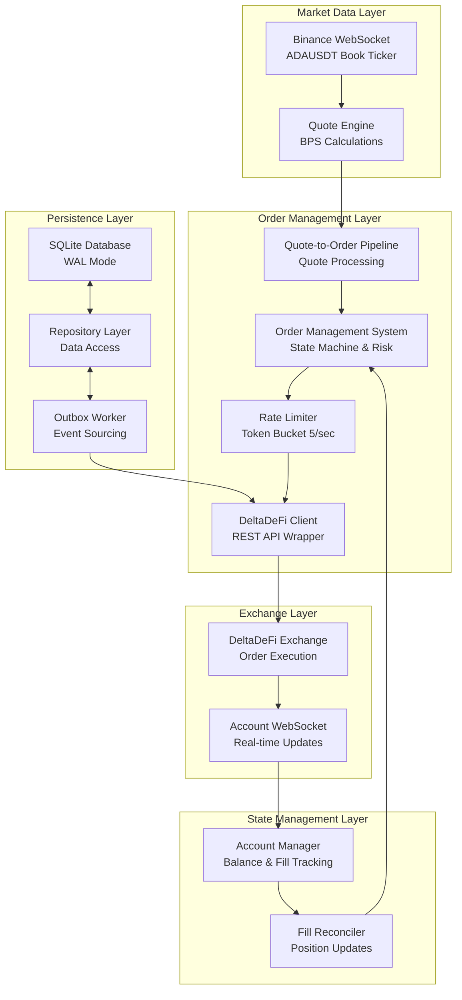

# Architecture Overview

High-level system architecture and design principles for the DeltaDeFi trading bot.

## Mission

Provide automated market making between Binance ADAUSDT and DeltaDeFi ADAUSDM with configurable spreads, comprehensive risk management, and production-grade reliability.

## System Architecture

## Core Components

| Component                                             | Purpose                                   | Implementation           |
| ----------------------------------------------------- | ----------------------------------------- | ------------------------ |
| **[Quote Engine](quote-engine.md)**                   | Price generation with BPS calculations    | `bot/quote.py`           |
| **[Order Management System](oms.md)**                 | Order lifecycle and risk management       | `bot/oms.py`             |
| **[Account Manager](account-manager.md)**             | Balance tracking and fill reconciliation  | `bot/account_manager.py` |
| **[Rate Limiter](rate-limiter.md)**                   | API rate limiting (5 orders/second)       | `bot/rate_limiter.py`    |
| **[Database Layer](database.md)**                     | SQLite persistence with WAL mode          | `bot/db/sqlite.py`       |
| **[DeltaDeFi Integration](deltadefi-integration.md)** | Exchange connectivity and WebSocket feeds | `bot/deltadefi.py`       |
| **[Binance Integration](binance-integration.md)**     | Real-time market data ingestion           | `bot/binance_ws.py`      |

## Data Flow

### 1. Market Data Processing

1. **Binance WebSocket** receives ADAUSDT book ticker updates
2. **Quote Engine** applies BPS calculations and spread adjustments
3. **Quote-to-Order Pipeline** processes quotes and generates orders
4. **Order Management System** validates orders against risk limits

### 2. Order Execution

1. **Rate Limiter** enforces 5 orders/second DeltaDeFi limit
2. **DeltaDeFi Client** submits orders via REST API
3. **Order Management System** tracks order states (idle → pending → working → filled/cancelled)
4. **Database Layer** persists all order data with event sourcing

### 3. Fill Reconciliation

1. **Account WebSocket** receives real-time fill notifications from DeltaDeFi
2. **Account Manager** processes balance and position updates
3. **Fill Reconciler** matches fills with pending orders
4. **Order Management System** updates order states and positions

## Design Principles

### Reliability

- **Fault Tolerance**: Graceful handling of network disruptions, API errors, and exchange downtime
- **State Recovery**: Persistent state in SQLite with WAL mode for crash recovery
- **Rate Limiting**: Token bucket algorithm prevents API limit violations
- **Error Handling**: Comprehensive exception handling with structured logging

### Performance

- **Async Architecture**: Non-blocking I/O throughout the system using async/await
- **Efficient Processing**: Minimal latency from market data to order submission
- **Database Optimization**: SQLite WAL mode with connection pooling
- **Memory Management**: Bounded queues and cleanup of stale data

### Observability

- **Structured Logging**: JSON format with comprehensive event tracking
- **Health Monitoring**: Periodic status reports and metrics collection
- **Database Auditing**: Complete order history and position tracking
- **Performance Metrics**: Rate limiting, fill rates, and system health indicators

### Security

- **Credential Management**: Secure handling of API keys and trading passwords
- **Input Validation**: Pydantic models for configuration and data validation
- **Rate Limiting**: Protection against excessive API usage
- **Risk Controls**: Position limits, daily loss limits, and emergency stop functionality

## Configuration Management

The system uses a **two-tier configuration approach**:

> **📝 Complete Configuration Details**: See [CONFIG.md](../../CONFIG.md) for the full configuration system

- **Environment Variables** (`.env`): Sensitive credentials and environment-specific settings
- **YAML Configuration** (`config.yaml`): Trading parameters and strategy settings
- **Runtime Parameters**: Command-line overrides for development and testing

## Risk Management

### Position Controls

- **Maximum Position Size**: Configurable limit on net ADA position
- **Daily Loss Limits**: Automatic trading halt on excessive losses
- **Spread Controls**: Minimum and maximum spread boundaries
- **Emergency Stop**: Manual and automatic trading halt mechanisms

### Operational Controls

- **Rate Limiting**: Respect exchange API limits to prevent account restrictions
- **Connection Monitoring**: Automatic reconnection and health checks for WebSocket feeds
- **Data Validation**: Input validation and sanity checks on all market data and orders
- **Audit Trail**: Complete logging of all trading decisions and order states

## External Interfaces

### Market Data Sources

- **Binance WebSocket Stream**: Real-time ADAUSDT book ticker data
- **DeltaDeFi Market Data**: Price validation and market status

### Exchange Connectivity

- **DeltaDeFi REST API**: Order submission, cancellation, and account queries
- **DeltaDeFi WebSocket**: Real-time account updates, fills, and balance changes

### Monitoring & Operations

- **Structured Logs**: JSON format for log aggregation and analysis
- **Database Interface**: SQLite for manual queries and data analysis
- **Health Endpoints**: System status and performance metrics

---

> **📚 Component Documentation:**
> Each component has detailed documentation covering implementation details, APIs, configuration options, and integration patterns. See the links in the Core Components table above.
> **📖 User Documentation:**
>
> - [User Guide](../02-user-guide.md) - Setup, configuration, and operation
> - [Deployment Guide](../03-deployment.md) - Production deployment and monitoring
