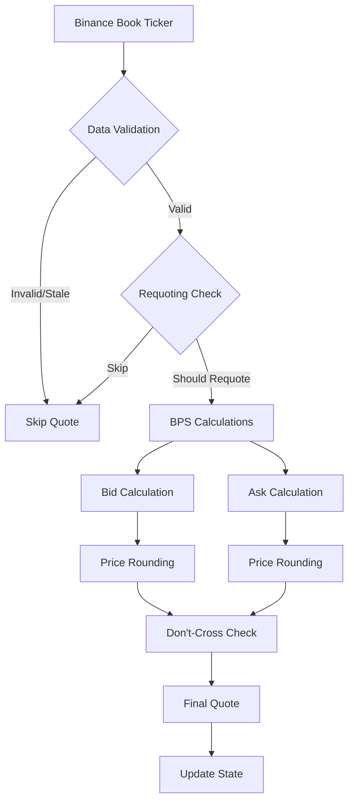

# Quote Engine

The Quote Engine is responsible for generating DeltaDeFi quotes from Binance market data using configurable basis point (BPS) spreads and intelligent requoting logic.

**Location**: `bot/quote.py:59`

## Overview

The Quote Engine transforms raw Binance book ticker data into actionable DeltaDeFi quotes with precise BPS calculations, requoting thresholds, and optional don't-cross protection.

### Key Features

- **BPS Spread Calculations**: Configurable basis point spreads with precision rounding
- **Intelligent Requoting**: Time and price-based thresholds to reduce noise
- **Don't-Cross Protection**: Optional market data integration to prevent crossing
- **Data Validation**: Staleness detection and data quality checks
- **Performance Optimization**: Efficient quote generation with minimal latency

## Architecture



## Core Components

### 1. Data Structures

**BookTicker** - Binance market data:

```python
@dataclass
class BookTicker:
    symbol: str
    bid_price: float
    bid_qty: float
    ask_price: float
    ask_qty: float
    timestamp: float
```

**Quote** - Generated DeltaDeFi quote:

```python
@dataclass
class Quote:
    symbol: str                    # DeltaDeFi symbol (e.g., "ADAUSDM")
    bid_price: float | None       # Our bid price
    bid_qty: float | None         # Our bid quantity
    ask_price: float | None       # Our ask price
    ask_qty: float | None         # Our ask quantity
    timestamp: float              # Quote generation time
    source_data: BookTicker       # Original Binance data
```

### 2. Quote Engine Class

**Location**: `bot/quote.py:59`

```python
class QuoteEngine:
    def __init__(self):
        self.last_quote_time = 0.0
        self.last_source_prices: BookTicker | None = None
        self._precision = 6  # Price precision for rounding
```

## BPS Calculations

### Spread Application

The core spread calculation applies configurable basis points to Binance prices:

```python
# Bid calculation: reduce price by total BPS
bid_price = binance_bid * (1 - total_spread_bps / 10000)

# Ask calculation: increase price by total BPS
ask_price = binance_ask * (1 + total_spread_bps / 10000)
```

**Example**:

- Binance ADAUSDT: Bid $0.4500, Ask $0.4502
- Total spread: 8 BPS (0.08%)
- DeltaDeFi ADAUSDM: Bid $0.4464, Ask $0.4538

### Bid Price Calculation

**Location**: `bot/quote.py:129`

```python
def _calculate_bid(self, book_ticker: BookTicker) -> tuple[float | None, float | None]:
    if not settings.is_side_enabled("bid"):
        return None, None

    # Apply BPS reduction to Binance bid
    total_bps = settings.total_spread_bps
    bid_price = book_ticker.bid_price * (1 - total_bps / 10000)

    # Round to appropriate precision
    bid_price = self._round_price(bid_price)

    # Apply configured quantity
    bid_qty = min(settings.trading.qty, settings.trading.min_quote_size)

    return bid_price, bid_qty
```

### Ask Price Calculation

**Location**: `bot/quote.py:148`

```python
def _calculate_ask(self, book_ticker: BookTicker) -> tuple[float | None, float | None]:
    if not settings.is_side_enabled("ask"):
        return None, None

    # Apply BPS increase to Binance ask
    total_bps = settings.total_spread_bps
    ask_price = book_ticker.ask_price * (1 + total_bps / 10000)

    # Round to appropriate precision
    ask_price = self._round_price(ask_price)

    # Apply configured quantity
    ask_qty = min(settings.trading.qty, settings.trading.min_quote_size)

    return ask_price, ask_qty
```

### Price Precision

**Location**: `bot/quote.py:167`

```python
def _round_price(self, price: float) -> float:
    """Round price to 6 decimal places using banker's rounding"""
    decimal_price = Decimal(str(price))
    rounded = decimal_price.quantize(
        Decimal("0.000001"),
        rounding=ROUND_HALF_UP
    )
    return float(rounded)
```

## Intelligent Requoting

### Requoting Logic

The engine implements sophisticated logic to minimize unnecessary quote updates:

**Location**: `bot/quote.py:175`

```python
def _should_skip_requote(self, book_ticker: BookTicker, current_time: float) -> bool:
    # Time threshold: minimum time between quotes
    time_since_last = (current_time - self.last_quote_time) * 1000  # ms
    if time_since_last < settings.trading.min_requote_ms:
        return True

    # Price movement threshold: minimum price change
    if self.last_source_prices:
        bid_change = abs(book_ticker.bid_price - self.last_source_prices.bid_price)
        ask_change = abs(book_ticker.ask_price - self.last_source_prices.ask_price)
        max_change = max(bid_change, ask_change)

        if max_change < settings.trading.requote_tick_threshold:
            return True

    return False
```

### Staleness Detection

**Location**: `bot/quote.py:195`

```python
def _is_data_stale(self, book_ticker: BookTicker, current_time: float) -> bool:
    """Check if market data is too old to use"""
    age_ms = (current_time - book_ticker.timestamp) * 1000
    return age_ms > settings.trading.stale_ms
```

**Default Thresholds**:

- **Min Requote Time**: 100ms between quote updates
- **Price Threshold**: 0.0001 minimum price movement
- **Staleness Limit**: 5000ms maximum data age

## Don't-Cross Protection

### Current Implementation

**Location**: `bot/quote.py:200`

```python
def _apply_dont_cross_protection(
    self, bid_price: float | None, ask_price: float | None
) -> tuple[float | None, float | None]:
    """Ensure our quotes don't cross each other"""
    if bid_price and ask_price and bid_price >= ask_price:
        logger.warning("Generated bid >= ask, adjusting prices",
                      bid=bid_price, ask=ask_price)

        # Widen spread around midpoint
        mid = (bid_price + ask_price) / 2
        spread = settings.total_spread_bps / 10000
        bid_price = mid * (1 - spread / 2)
        ask_price = mid * (1 + spread / 2)

    return bid_price, ask_price
```

### Future Enhancement

The protection system is designed to integrate with DeltaDeFi market data:

```python
# TODO: Implement DeltaDeFi market data integration
# Check DeltaDeFi order book to ensure we don't cross existing orders
# Subscribe to /market/depth/:symbol for real-time book updates
# Apply more sophisticated crossing prevention logic
```

## Data Processing Flow

### Binance Integration

**Location**: `bot/quote.py:233`

The engine integrates with Binance WebSocket data via helper function:

```python
def create_book_ticker_from_binance(data: dict[str, Any]) -> BookTicker:
    """Convert Binance WebSocket message to BookTicker"""
    return BookTicker(
        symbol=data["s"],                # Symbol (e.g., "ADAUSDT")
        bid_price=float(data["b"]),      # Best bid price
        bid_qty=float(data["B"]),        # Best bid quantity
        ask_price=float(data["a"]),      # Best ask price
        ask_qty=float(data["A"]),        # Best ask quantity
        timestamp=time.time(),           # Add local timestamp
    )
```

**Expected Binance Format**:

```json
{
  "u": 400900217,
  "s": "ADAUSDT",
  "b": "0.45000000",
  "B": "31.21000000",
  "a": "0.45020000",
  "A": "40.66000000"
}
```

### Quote Generation

**Location**: `bot/quote.py:72`

```python
def generate_quote(self, book_ticker: BookTicker) -> Quote | None:
    current_time = time.time()

    # Skip if data is stale or requoting threshold not met
    if self._should_skip_requote(book_ticker, current_time):
        return None

    if self._is_data_stale(book_ticker, current_time):
        logger.warning("Market data is stale, skipping quote generation")
        return None

    # Generate quotes for enabled sides
    bid_price, bid_qty = self._calculate_bid(book_ticker)
    ask_price, ask_qty = self._calculate_ask(book_ticker)

    # Apply don't-cross protection
    bid_price, ask_price = self._apply_dont_cross_protection(bid_price, ask_price)

    # Update engine state
    self.last_quote_time = current_time
    self.last_source_prices = book_ticker

    return Quote(
        symbol=settings.trading.symbol_dst,
        bid_price=bid_price,
        bid_qty=bid_qty,
        ask_price=ask_price,
        ask_qty=ask_qty,
        timestamp=current_time,
        source_data=book_ticker,
    )
```

## Configuration

### Trading Parameters

```yaml
trading:
  symbol_src: "ADAUSDT" # Binance source symbol
  symbol_dst: "ADAUSDM" # DeltaDeFi destination symbol
  qty: 100 # Base order quantity
  min_quote_size: 10 # Minimum quote size
  side_enable: ["bid", "ask"] # Enabled quote sides

  # Requoting thresholds
  min_requote_ms: 100 # Minimum time between quotes
  requote_tick_threshold: 0.0001 # Minimum price movement
  stale_ms: 5000 # Data staleness threshold
```

### Spread Configuration

```yaml
# Total spread in basis points
total_spread_bps: 8 # 0.08% total spread

# Alternative: Separate components
anchor_bps: 5 # Distance from Binance BBO
venue_spread_bps: 3 # Cross-venue risk buffer
```

## API Reference

### Quote Properties

```python
quote = Quote(...)

# Calculated properties
quote.mid_price        # Midpoint between bid and ask
quote.spread_bps       # Spread in basis points
```

### Engine Statistics

```python
engine = QuoteEngine()
stats = engine.get_stats()

# Returns:
{
    "last_quote_time": 1642678900.123,
    "has_last_source_prices": True,
    "total_spread_bps": 8,
    "sides_enabled": ["bid", "ask"]
}
```

## Usage Examples

### Basic Quote Generation

```python
from bot.quote import QuoteEngine, create_book_ticker_from_binance

engine = QuoteEngine()

# Process Binance WebSocket message
binance_data = {
    "s": "ADAUSDT",
    "b": "0.45000000",
    "B": "1000.00",
    "a": "0.45020000",
    "A": "800.00"
}

# Convert to BookTicker
book_ticker = create_book_ticker_from_binance(binance_data)

# Generate quote
quote = engine.generate_quote(book_ticker)

if quote:
    print(f"Generated quote for {quote.symbol}:")
    print(f"  Bid: ${quote.bid_price} (qty: {quote.bid_qty})")
    print(f"  Ask: ${quote.ask_price} (qty: {quote.ask_qty})")
    print(f"  Spread: {quote.spread_bps:.2f} BPS")
else:
    print("Quote generation skipped (requoting threshold)")
```

### Integration with Trading Pipeline

```python
# In main.py TradingBot class
async def _process_binance_message(self, message: dict[str, Any]):
    # Create BookTicker from Binance data
    book_ticker = create_book_ticker_from_binance(message)

    # Generate quote using quote engine
    quote = self.quote_engine.generate_quote(book_ticker)

    if quote:
        # Process through quote pipeline
        processed_quote = await self.quote_pipeline.process_quote(quote)
        logger.info("Quote processed", quote_id=processed_quote.quote_id)
```

## Performance Considerations

### Latency Optimization

- **Minimal Computation**: Simple mathematical operations for BPS calculations
- **Early Termination**: Skip processing if requoting thresholds not met
- **Efficient Rounding**: Using Decimal for precise price calculations
- **State Caching**: Cache last source prices to avoid redundant processing

### Memory Management

- **Lightweight Objects**: BookTicker and Quote use minimal memory
- **No Historical Storage**: Engine maintains minimal state
- **Garbage Collection**: Objects eligible for GC after processing

### Precision Handling

- **Decimal Arithmetic**: Use Decimal for financial calculations
- **Rounding Strategy**: ROUND_HALF_UP for consistent behavior
- **Float Conversion**: Convert to float only for final output

## Monitoring & Metrics

### Quote Generation Metrics

```python
# Track quote generation statistics
quotes_generated = 0      # Total quotes generated
quotes_skipped = 0        # Quotes skipped due to thresholds
stale_data_events = 0     # Stale data detections
processing_latency = []   # Quote generation latency
```

### Health Checks

```python
# Monitor quote engine health
def check_quote_engine_health():
    stats = engine.get_stats()

    # Check for recent activity
    time_since_last = time.time() - stats["last_quote_time"]
    if time_since_last > 30:  # 30 seconds
        logger.warning("Quote engine inactive", idle_time=time_since_last)

    # Validate configuration
    if stats["total_spread_bps"] <= 0:
        logger.error("Invalid spread configuration")
```

## Integration Points

### Binance WebSocket Integration

**Location**: `bot/binance_ws.py:80`

```python
# Quote engine receives data from Binance WebSocket
book_ticker = create_book_ticker_from_binance(message)
quote = quote_engine.generate_quote(book_ticker)
```

### Quote Pipeline Integration

**Location**: `bot/quote_to_order_pipeline.py:78`

```python
# Pipeline processes quotes from engine
processed_quote = await quote_pipeline.process_quote(quote)
```

### Configuration Integration

**Location**: `bot/config.py`

```python
# Quote engine uses centralized configuration
total_spread = settings.total_spread_bps
symbol_dst = settings.trading.symbol_dst
sides_enabled = settings.trading.side_enable
```

## Testing

### Unit Tests

```python
# test_quote_engine.py
def test_bps_calculation():
    """Test BPS spread calculations"""
    engine = QuoteEngine()

    book_ticker = BookTicker(
        symbol="ADAUSDT",
        bid_price=0.4500,
        ask_price=0.4502,
        bid_qty=1000,
        ask_qty=800,
        timestamp=time.time()
    )

    quote = engine.generate_quote(book_ticker)

    # Verify BPS application (8 BPS = 0.08%)
    expected_bid = 0.4500 * (1 - 8/10000)  # 0.4464
    expected_ask = 0.4502 * (1 + 8/10000)  # 0.45056

    assert abs(quote.bid_price - expected_bid) < 1e-6
    assert abs(quote.ask_price - expected_ask) < 1e-6
```

### Integration Tests

```python
def test_quote_pipeline_integration():
    """Test quote engine with full pipeline"""
    # Test end-to-end quote processing
    # Verify proper integration with other components
```

The Quote Engine serves as the mathematical heart of the trading system, converting market data into actionable trading opportunities with precision and efficiency.
