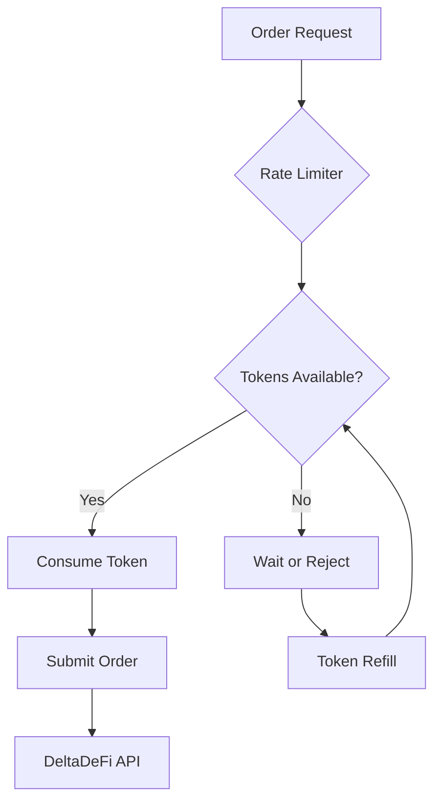

# Rate Limiter

The Rate Limiter provides sophisticated API rate limiting to respect DeltaDeFi's 5 orders/second limit using token bucket and sliding window algorithms.

**Location**: `bot/rate_limiter.py:14`

## Overview

The Rate Limiter implements multiple rate limiting strategies to ensure the trading bot operates within DeltaDeFi's API constraints while maximizing order throughput and providing predictable behavior.

### Key Features

- **Token Bucket Algorithm**: Primary rate limiting with configurable burst capacity
- **Sliding Window Alternative**: Alternative implementation for different use cases
- **Async/Await Support**: Non-blocking token acquisition with wait capabilities
- **Real-time Monitoring**: Status reporting and utilization metrics
- **Thread Safety**: Concurrent access protection with asyncio locks

## Architecture



## Token Bucket Algorithm

### Core Implementation

**Location**: `bot/rate_limiter.py:14`

```python
class TokenBucketRateLimiter:
    def __init__(self, max_tokens: int = 5, refill_rate: float = 5.0):
        """
        Token bucket rate limiter for DeltaDeFi's 5 orders/second limit

        Args:
            max_tokens: Bucket capacity (5 for DeltaDeFi)
            refill_rate: Tokens added per second (5.0 for DeltaDeFi)
        """
        self.max_tokens = max_tokens
        self.refill_rate = refill_rate
        self.tokens = max_tokens
        self.last_refill = time.time()
        self._lock = asyncio.Lock()
```

### Token Mechanics

**Bucket Properties**:

- **Capacity**: 5 tokens (matches DeltaDeFi limit)
- **Refill Rate**: 5 tokens/second (1 token every 200ms)
- **Initial State**: Bucket starts full (5 tokens)
- **Burst Handling**: Allows up to 5 rapid requests, then steady 5/second

### Token Acquisition

**Location**: `bot/rate_limiter.py:33`

```python
async def acquire(self, tokens: int = 1) -> bool:
    """
    Try to acquire tokens for order submission

    Returns:
        True if tokens acquired, False if rate limited
    """
    async with self._lock:
        self._refill()  # Add tokens based on elapsed time

        if self.tokens >= tokens:
            self.tokens -= tokens
            logger.debug(
                "Rate limit token acquired",
                tokens_used=tokens,
                tokens_remaining=self.tokens,
            )
            return True

        logger.warning(
            "Rate limit exceeded",
            tokens_requested=tokens,
            tokens_available=self.tokens,
            wait_time=self._time_until_available(tokens),
        )
        return False
```

### Token Refill Logic

**Location**: `bot/rate_limiter.py:79`

```python
def _refill(self) -> None:
    """Refill tokens based on elapsed time"""
    now = time.time()
    elapsed = now - self.last_refill

    if elapsed > 0:
        # Add tokens proportional to elapsed time
        tokens_to_add = elapsed * self.refill_rate
        self.tokens = min(self.max_tokens, self.tokens + tokens_to_add)
        self.last_refill = now
```

**Refill Calculation**:

- **Continuous Refill**: Tokens added proportionally to elapsed time
- **Fractional Accumulation**: Supports sub-second precision
- **Cap at Maximum**: Never exceed bucket capacity
- **High Precision**: Uses floating-point for smooth refill

### Blocking Token Acquisition

**Location**: `bot/rate_limiter.py:63`

```python
async def wait_for_token(self, tokens: int = 1) -> None:
    """
    Wait until enough tokens are available

    Blocks until tokens can be acquired
    """
    while not await self.acquire(tokens):
        wait_time = self._time_until_available(tokens)
        logger.info(
            "Waiting for rate limit tokens",
            wait_time=wait_time,
            tokens_needed=tokens,
        )
        # Check every 100ms maximum to avoid busy waiting
        await asyncio.sleep(min(wait_time, 0.1))
```

## Sliding Window Algorithm

### Alternative Implementation

**Location**: `bot/rate_limiter.py:108`

```python
class SlidingWindowRateLimiter:
    def __init__(self, max_requests: int = 5, window_size: float = 1.0):
        """
        Sliding window rate limiter

        Args:
            max_requests: Max requests per window (5 for DeltaDeFi)
            window_size: Window size in seconds (1.0 for per-second limit)
        """
        self.max_requests = max_requests
        self.window_size = window_size
        self.requests = deque()  # Timestamps of recent requests
        self._lock = asyncio.Lock()
```

### Window Management

```python
async def acquire(self) -> bool:
    """Try to acquire permission for one request"""
    async with self._lock:
        now = time.time()

        # Remove requests outside current window
        while self.requests and self.requests[0] <= now - self.window_size:
            self.requests.popleft()

        # Check if we can make another request
        if len(self.requests) < self.max_requests:
            self.requests.append(now)
            return True

        return False
```

**Key Differences from Token Bucket**:

- **Fixed Window**: Exactly N requests per sliding window
- **No Burst**: Cannot accumulate requests beyond current window
- **Memory Usage**: Stores timestamp for each request
- **Precision**: More precise enforcement of rate limits

## Usage Patterns

### DeltaDeFi Client Integration

**Location**: `bot/deltadefi.py:46`

```python
class DeltaDeFiClient:
    def __init__(self, rate_limiter: TokenBucketRateLimiter | None = None):
        self.rate_limiter = rate_limiter or TokenBucketRateLimiter(
            max_tokens=int(settings.system.max_orders_per_second),
            refill_rate=settings.system.max_orders_per_second,
        )

    async def submit_order(self, ...):
        # Wait for rate limit before submission
        await self.rate_limiter.wait_for_token()

        # Proceed with order submission
        result = self._client.post_order(...)
        return result
```

### Order Manager Integration

**Location**: `bot/order_manager.py:184`

```python
class OrderManager:
    def __init__(self, rate_limiter: TokenBucketRateLimiter | None = None):
        self.rate_limiter = rate_limiter or TokenBucketRateLimiter()

    async def _process_next_order(self):
        """Process next order if rate limit allows"""
        if await self.rate_limiter.acquire():
            # Rate limit available - process order
            await self._submit_order(order)
        else:
            # Rate limited - log and continue
            logger.debug("Order submission rate limited")
```

## Configuration

### Token Bucket Configuration

```python
# Standard DeltaDeFi configuration
rate_limiter = TokenBucketRateLimiter(
    max_tokens=5,        # 5 token bucket capacity
    refill_rate=5.0,     # 5 tokens per second refill
)

# Conservative configuration
rate_limiter = TokenBucketRateLimiter(
    max_tokens=3,        # Smaller burst capacity
    refill_rate=4.0,     # Slightly below limit
)

# Aggressive configuration (not recommended)
rate_limiter = TokenBucketRateLimiter(
    max_tokens=10,       # Large burst capacity
    refill_rate=5.0,     # At DeltaDeFi limit
)
```

### Environment Variables

```yaml
system:
  max_orders_per_second: 5 # Rate limit (tokens/second)
  rate_limit_burst: 5 # Burst capacity (max tokens)
  rate_limit_strategy: "token_bucket" # or "sliding_window"
```

## Performance Characteristics

### Token Bucket Behavior

**Burst Scenarios**:

```python
# Scenario 1: 5 rapid orders (burst)
for i in range(5):
    success = await rate_limiter.acquire()  # All succeed immediately

# Scenario 2: 6th order (rate limited)
success = await rate_limiter.acquire()  # Returns False
```

**Steady State**:

```python
# Orders at exactly 5/second rate
while True:
    await rate_limiter.wait_for_token()  # Waits 200ms between orders
    await submit_order()
```

### Timing Analysis

| Scenario             | Token Bucket             | Sliding Window           |
| -------------------- | ------------------------ | ------------------------ |
| **5 rapid requests** | ✅ All immediate         | ✅ All immediate         |
| **6th immediate**    | ❌ Blocked until refill  | ❌ Blocked until window  |
| **Steady 5/sec**     | ✅ Consistent 200ms gaps | ✅ Enforces exact timing |
| **Memory usage**     | O(1) constant            | O(N) per window          |
| **CPU overhead**     | Very low                 | Low                      |

## Monitoring & Metrics

### Status Reporting

**Location**: `bot/rate_limiter.py:97`

```python
def get_status(self) -> dict:
    """Get current rate limiter status"""
    self._refill()  # Update token count
    return {
        "tokens_available": self.tokens,
        "max_tokens": self.max_tokens,
        "refill_rate": self.refill_rate,
        "utilization": (self.max_tokens - self.tokens) / self.max_tokens,
    }
```

**Status Fields**:

- **tokens_available**: Current tokens in bucket
- **max_tokens**: Bucket capacity
- **refill_rate**: Tokens per second refill rate
- **utilization**: Percentage of capacity used (0.0 to 1.0)

### Health Monitoring

```python
# Monitor rate limiter health
async def monitor_rate_limiter():
    while True:
        status = rate_limiter.get_status()

        # Alert on high utilization
        if status["utilization"] > 0.8:
            logger.warning(
                "High rate limiter utilization",
                utilization=status["utilization"],
                tokens_available=status["tokens_available"]
            )

        await asyncio.sleep(10)  # Check every 10 seconds
```

### Performance Metrics

```python
# Track rate limiting metrics
class RateLimitMetrics:
    def __init__(self):
        self.total_requests = 0
        self.blocked_requests = 0
        self.wait_times = []

    async def track_request(self, rate_limiter):
        start_time = time.time()

        if await rate_limiter.acquire():
            self.total_requests += 1
        else:
            self.blocked_requests += 1
            wait_time = time.time() - start_time
            self.wait_times.append(wait_time)

    def get_stats(self):
        return {
            "success_rate": self.total_requests / (self.total_requests + self.blocked_requests),
            "avg_wait_time": sum(self.wait_times) / len(self.wait_times) if self.wait_times else 0,
            "max_wait_time": max(self.wait_times) if self.wait_times else 0,
        }
```

## API Reference

### TokenBucketRateLimiter

```python
# Construction
rate_limiter = TokenBucketRateLimiter(max_tokens=5, refill_rate=5.0)

# Non-blocking acquisition
success = await rate_limiter.acquire(tokens=1)

# Blocking acquisition
await rate_limiter.wait_for_token(tokens=1)

# Status monitoring
status = rate_limiter.get_status()
```

### SlidingWindowRateLimiter

```python
# Construction
rate_limiter = SlidingWindowRateLimiter(max_requests=5, window_size=1.0)

# Non-blocking acquisition
success = await rate_limiter.acquire()

# Blocking acquisition
await rate_limiter.wait_for_slot()

# Status monitoring
status = rate_limiter.get_status()
```

## Usage Examples

### Basic Rate Limiting

```python
from bot.rate_limiter import TokenBucketRateLimiter

# Create rate limiter
rate_limiter = TokenBucketRateLimiter(max_tokens=5, refill_rate=5.0)

# Submit orders with rate limiting
async def submit_orders(orders):
    for order in orders:
        # Wait for rate limit token
        await rate_limiter.wait_for_token()

        # Submit order (guaranteed to be within rate limit)
        await deltadefi_client.submit_order(order)

        logger.info(f"Order submitted: {order.id}")
```

### Burst Handling

```python
# Handle burst of orders
async def handle_order_burst(urgent_orders):
    successful = 0
    failed = 0

    for order in urgent_orders:
        if await rate_limiter.acquire():
            await submit_order(order)
            successful += 1
        else:
            # Queue for later or handle differently
            await queue_order_for_later(order)
            failed += 1

    logger.info(f"Burst handled: {successful} immediate, {failed} queued")
```

### Rate Limit Monitoring

```python
# Monitor and log rate limiter status
async def monitor_rate_limits():
    while True:
        status = rate_limiter.get_status()

        logger.info(
            "Rate limiter status",
            tokens_available=status["tokens_available"],
            utilization=f"{status['utilization']:.1%}",
        )

        # Alert if consistently high utilization
        if status["utilization"] > 0.9:
            logger.warning("Rate limiter near capacity")

        await asyncio.sleep(5)
```

## Testing

### Unit Tests

```python
import pytest
import asyncio
from bot.rate_limiter import TokenBucketRateLimiter

@pytest.mark.asyncio
async def test_token_acquisition():
    """Test basic token acquisition"""
    limiter = TokenBucketRateLimiter(max_tokens=3, refill_rate=1.0)

    # Should succeed up to capacity
    assert await limiter.acquire() == True
    assert await limiter.acquire() == True
    assert await limiter.acquire() == True

    # Should fail when capacity exceeded
    assert await limiter.acquire() == False

@pytest.mark.asyncio
async def test_token_refill():
    """Test token refill over time"""
    limiter = TokenBucketRateLimiter(max_tokens=2, refill_rate=2.0)

    # Exhaust tokens
    await limiter.acquire()
    await limiter.acquire()
    assert await limiter.acquire() == False

    # Wait for refill (0.5 seconds = 1 token at 2/sec rate)
    await asyncio.sleep(0.5)
    assert await limiter.acquire() == True
```

### Integration Tests

```python
@pytest.mark.asyncio
async def test_deltadefi_integration():
    """Test rate limiter with DeltaDeFi client"""
    rate_limiter = TokenBucketRateLimiter(max_tokens=2, refill_rate=1.0)
    client = DeltaDeFiClient(rate_limiter=rate_limiter)

    # Should handle burst then rate limit
    start_time = time.time()

    # First 2 orders should be immediate
    await client.submit_order(create_test_order())
    await client.submit_order(create_test_order())

    # Third order should wait for refill
    await client.submit_order(create_test_order())

    elapsed = time.time() - start_time
    assert elapsed >= 1.0  # Should have waited at least 1 second
```

## Best Practices

### Configuration Guidelines

1. **Conservative Settings**: Start with lower limits than DeltaDeFi maximum
2. **Burst Control**: Limit burst capacity to prevent API overload
3. **Monitoring**: Always monitor utilization and success rates
4. **Testing**: Test rate limiting behavior under load

### Error Handling

```python
async def robust_order_submission(order, rate_limiter, max_retries=3):
    """Submit order with rate limiting and retry logic"""
    for attempt in range(max_retries):
        try:
            # Wait for rate limit
            await rate_limiter.wait_for_token()

            # Submit order
            result = await submit_order(order)
            return result

        except RateLimitError:
            # Wait longer and retry
            await asyncio.sleep(2 ** attempt)
            continue
        except Exception as e:
            logger.error(f"Order submission failed: {e}")
            raise

    raise Exception("Max retries exceeded")
```

### Performance Optimization

- **Token Bucket vs Sliding Window**: Use token bucket for better burst handling
- **Lock Optimization**: Minimize time spent in critical sections
- **Memory Management**: Token bucket has O(1) memory usage
- **Precision**: Balance precision with performance needs

The Rate Limiter is a critical component ensuring the trading bot operates within exchange constraints while maximizing performance and providing predictable behavior for order management.
